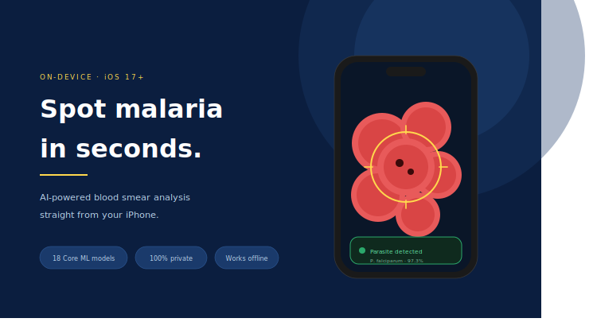
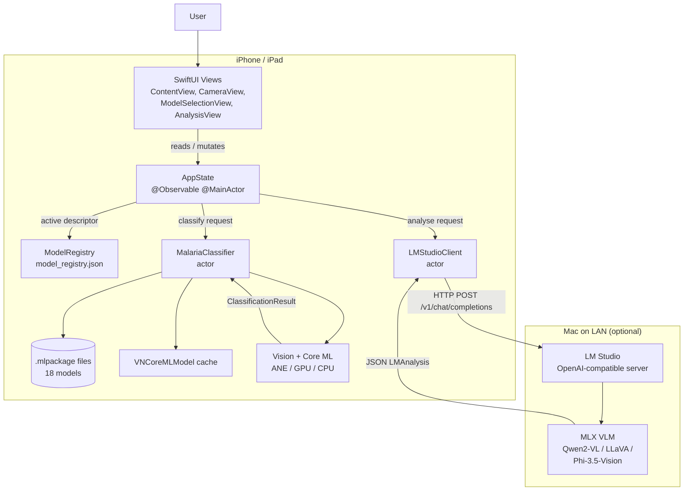
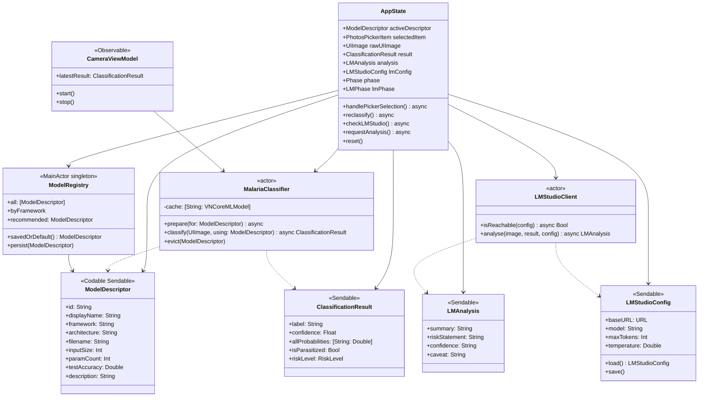
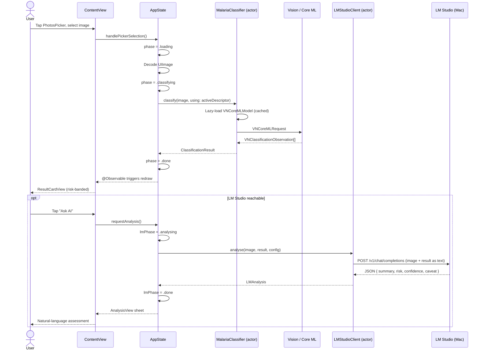
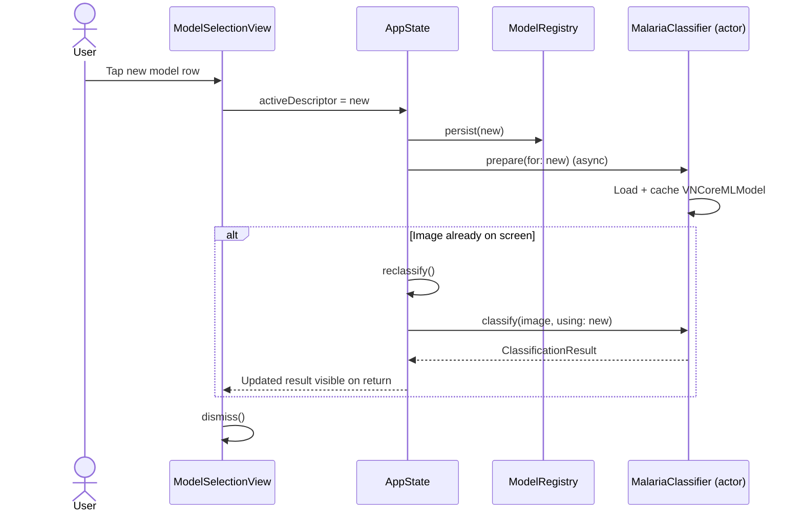

# Malaria Detector

On-device malaria cell classification for iOS, combining a Core ML CNN with an optional local vision-language model for natural-language clinical explanation.




## Overview

Malaria is a life-threatening disease traditionally diagnosed by manual microscopy of thin blood smears — a slow, error-prone workflow that depends on scarce specialist labour and is especially strained in resource-limited regions. **Malaria Detector** is a planned iOS application that brings a trained convolutional classifier to the clinician's pocket: an image of a red blood cell (from the Photo Library or live camera) is classified as *Parasitized* or *Uninfected* on-device in under 10 ms, with no patient data leaving the phone.

A second, optional layer adds clinical context. When a Mac running [LM Studio](https://lmstudio.ai) is reachable on the same network, the app can forward the image and the Core ML result to a locally hosted Vision-Language Model (Qwen2-VL, LLaVA, Phi-3.5-Vision) that returns a structured, natural-language assessment. Both stages run without any cloud dependency.

The project doubles as an end-to-end reference for a modern Apple ML workflow: dataset preparation, two-framework training (TensorFlow / PyTorch), dual-resolution experimentation (64×64 and 128×128), Core ML export for 18 model variants, and a strict-concurrency Swift 6 iOS client built on iOS 17 environment injection.

## Key Features

| Domain | Feature |
|---|---|
| Classification | On-device binary classification (*Parasitized* / *Uninfected*) with confidence and a four-level risk band |
| Model Selection | Live in-app picker across 18 models (Keras and PyTorch variants, 64×64 and 128×128) loaded from a JSON registry |
| Image Input | Photos app picker plus a live camera tab with throttled real-time classification |
| Inference | Thread-safe `actor`-based Core ML / Vision pipeline with lazy model loading and LRU-style eviction |
| LLM Analysis | Optional local VLM analysis via LM Studio's OpenAI-compatible API — returns summary, risk statement, confidence, and caveat |
| Configuration | Persisted LM Studio base URL and model selection, with MLX quick-fill presets |
| Privacy | Nothing leaves the device except an opt-in HTTP call to the user's own Mac on the local network |
| Performance | EfficientNetB3 at 128×128 achieves ~97.5–98.5% test accuracy; MobileNetV3Large delivers ~96% at <1 ms latency for real-time camera use |
| Deployment | Swift 6 with `-strict-concurrency=complete`, `@Observable` state, environment injection, on-demand download path for large (~50 MB) models |

## Tech Stack

| Category | Technology | Purpose |
|---|---|---|
| iOS UI | SwiftUI (iOS 17+) | Declarative views, TabView shell, Photos picker |
| App State | `@Observable` + `.environment(_:)` | Single `AppState` shared across all views, no binding chains |
| Concurrency | Swift 6 strict concurrency, `actor`, `async/await` | Thread-safe classifier and LM Studio client |
| On-device ML | Core ML + Vision (`VNCoreMLRequest`) | `.mlpackage` inference on ANE / GPU / CPU |
| Camera | AVFoundation capture session | Live frame acquisition in `CameraViewModel` |
| Photo Library | PhotosPicker + PhotosUI | User-initiated image selection |
| Networking | `URLSession` async APIs | OpenAI-compatible POST to LM Studio |
| Persistence | `UserDefaults` | Remembers selected model and LM Studio configuration |
| Training — framework A | TensorFlow / Keras | Keras models from base CNN through EfficientNetB3 |
| Training — framework B | PyTorch + torchvision | Mirror architectures plus two-phase fine-tuning |
| Augmentation | Keras `ImageDataGenerator`, Albumentations | Rotation, flip, zoom, brightness jitter |
| Preprocessing | OpenCV, NumPy, PIL | Resize, HSV conversion, Gaussian blur, normalisation |
| Export | `coremltools`, ONNX (opset 17) | Keras → Core ML direct; PyTorch → ONNX → Core ML |
| Local VLM | LM Studio + MLX (`mlx-community/Qwen2-VL-7B-Instruct-4bit` recommended) | Natural-language clinical explanation |
| Acceleration | Apple Neural Engine, Metal, MPS, CUDA | Training on Mac / Colab; inference on device |

## Architecture

The application is organised in two cooperating layers. The **Core ML layer** is always present: an `actor`-based classifier loads the currently selected `.mlpackage` lazily, caches a `VNCoreMLModel` for the session, and returns a `Sendable` `ClassificationResult` to the UI. The **LM Studio layer** is optional: when reachable, it enriches the binary result with a natural-language assessment produced by a Vision-Language Model running on a Mac on the same network.

All shared mutable state lives in a single `@Observable @MainActor AppState` class, injected once at the app root via `.environment(_:)`. Views at any depth read what they need with `@Environment(AppState.self)` — there are no per-view view models and no binding chains. A `ModelRegistry` singleton reads `model_registry.json` from the bundle at launch and exposes sorted, framework-grouped descriptors for the model picker. On-device model files live alongside the registry in the app bundle, with a documented on-demand download path for the heavier architectures (~50 MB EfficientNetB3 / ResNet50V2).



## Code Structure

### Planned directory layout

```
MalariaDetector/
├── MalariaDetectorApp.swift
├── Models/
│   ├── DomainTypes.swift           # ModelDescriptor, ClassificationResult, errors
│   ├── ModelRegistry.swift         # Loads model_registry.json, persists selection
│   ├── MalariaClassifier.swift     # actor — Core ML + Vision inference
│   ├── AppState.swift              # @Observable single source of truth
│   ├── LMStudioTypes.swift         # Config, OpenAI-compatible DTOs, LMAnalysis
│   └── LMStudioClient.swift        # actor — HTTP client for LM Studio
├── ViewModels/
│   └── CameraViewModel.swift       # AVFoundation capture + throttled inference
├── Views/
│   ├── ContentView.swift           # Photo tab: picker → result → "Ask AI"
│   ├── CameraView.swift            # Live camera tab
│   ├── ModelSelectionView.swift    # Grouped list across Keras / PyTorch
│   ├── ActiveModelBadge.swift      # Tappable pill showing active model
│   ├── ResultCardView.swift        # Risk-banded classification display
│   ├── AnalysisView.swift          # LM Studio analysis sheet
│   └── LMStudioSettingsView.swift  # URL, model, temperature, MLX presets
└── Resources/
    ├── model_registry.json
    └── malaria_coreml_models/
        ├── Malaria_Base_Keras.mlpackage
        ├── Malaria_Deeper_Keras.mlpackage
        ├── Malaria_BNLeaky_Keras.mlpackage
        ├── Malaria_Augmented_Keras.mlpackage
        ├── Malaria_VGG16_Keras.mlpackage
        ├── Malaria_EfficientNetB0_Keras.mlpackage
        ├── Malaria_EfficientNetB3_Keras.mlpackage
        ├── Malaria_ResNet50V2_Keras.mlpackage
        ├── Malaria_MobileNetV3Large_Keras.mlpackage
        └── …mirrored PyTorch variants…

notebooks/
├── 01_data_and_preprocessing.ipynb
├── 02_tensorflow_64.ipynb
├── 03_pytorch_64.ipynb
├── 04_both_frameworks_128.ipynb
├── 05_advanced_pretrained.ipynb
├── 06_cross_framework_comparison.ipynb
└── 07_coreml_export.ipynb
```

### Main types



## Sequence Diagrams

### Photo classification plus optional LLM analysis

The primary user flow: pick a photo, see a Core ML classification, optionally forward the result to LM Studio for a natural-language explanation.



### Model selection and automatic reclassification

Changing the active model from the picker triggers eager preload of the new model and, when an image is already on screen, an automatic reclassification — all without any parent view knowing.



## Roadmap

This repository is currently at specification stage — the design is complete, training and Swift implementation are the next deliverables.

| Phase | Scope | Status |
|---|---|---|
| 1 | Dataset preparation, EDA, preprocessing (64×64 and 128×128) | Planned |
| 2 | TensorFlow / Keras training — Base, Deeper, BN+LeakyReLU, Augmented, VGG16 | Planned |
| 3 | PyTorch training — mirror architectures + EfficientNetB3 two-phase fine-tune | Planned |
| 4 | 128×128 re-run across both frameworks | Planned |
| 5 | Advanced pre-trained models — EfficientNetB0, ResNet50V2, MobileNetV3Large | Planned |
| 6 | Cross-framework and cross-resolution comparison, model registry freeze | Planned |
| 7 | Core ML export (Keras direct, PyTorch via ONNX opset 17) — 18 `.mlpackage` files | Planned |
| 8 | iOS 17 SwiftUI app — Photo tab, classifier actor, model picker | Planned |
| 9 | Live camera tab with throttled real-time classification | Planned |
| 10 | LM Studio integration — client actor, settings, analysis sheet | Planned |
| 11 | On-demand download path for heavyweight models + memory-pressure eviction | Planned |
| 12 | App Store review pass — accessibility, localisation, privacy manifest | Planned |

### Target metrics

| Metric | Target |
|---|---|
| Test accuracy (EfficientNetB3, 128×128) | 97.5 – 98.5% |
| Real-time model (MobileNetV3Large) latency on ANE | < 1 ms |
| Smallest deployed model size | < 5 MB (Augmented BN+LeakyReLU) |
| Minimum deployment target | iOS 17.0 |
| Swift language mode | Swift 6 with `-strict-concurrency=complete` |

## License

MIT — see LICENSE.
