# Malaria Detector


%2C%2010%2C%2011%2C%2013%2C%2014%20%2B%202-orange)

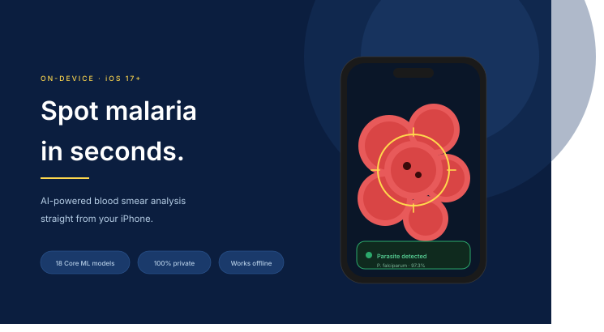

## What this repository is, today

This is a **Kotlin Multiplatform research prototype** for on-device malaria cell classification, targeting iOS and Android with a clinical-deployment compliance posture (encryption at rest, biometric gating, audit log, override flow, decision-support framing). The full design is in [`KMP_App_Specification.md`](./KMP_App_Specification.md) — that document is the source of truth; this README is the build-and-run companion.

The current branch (`scaffold/kmp`) lands Phases 0, 1, 2, **3**, 4, 5, 6, 7, **8 (both platforms)**, **9 (review override on both platforms + live override on both platforms)**, **10**, **11**, **13**, and **14** of the spec's §22 build plan — meaning a fresh device on **either platform** can now be **provisioned end-to-end from launch through admin → microscopist → operational tabs** via real onboarding screens, **clinicians on either platform can browse every persisted prediction, session, and audit-log entry through a fully wired History tab**, **a flagged prediction can be reviewed and overridden from History via a single-screen form gated on a fresh biometric prompt**, with the override columns and an `override_recorded` audit entry persisted together, and **the Home tab on both platforms drives a real on-device pipeline — tap Capture → real camera frame → on-device inference (Core ML on iOS, TFLite on Android) → SQLite-encrypted persistence with audit chain → optional 2-tap live override**. The shared Kotlin module is feature-complete for what `commonMain` is supposed to contain. The iOS app boots into the SwiftUI onboarding wizard, walks an admin through 8 provisioning screens and a microscopist through 4 claim screens (including a 3-page orientation walkthrough), persists with SwiftData under `NSFileProtectionComplete`, gates on biometrics via `LAContext`, and **runs real Core ML inference end-to-end** against the bundled Keras BNLeaky model in roughly 25 ms per 128×128 RGB tensor. The Android app mirrors that flow in Compose — `OnboardingFlow` routes through 8 admin + 4 microscopist step composables driving the now-Phase-6-parity `OnboardingState`, with `BiometricPrompt` (BIOMETRIC_STRONG | DEVICE_CREDENTIAL) under a suspend wrapper, language persistence via DataStore, and `MainActivity` upgraded to `FragmentActivity` so the biometric prompt can attach. Persistence is encrypted at rest with Room + SQLCipher (AES-256, Android Keystore-backed key with StrongBox preference and software fallback). The Phase 10 History tab on both platforms surfaces five subsections (Recent predictions, Flagged for review, Sessions, Audit log, Data management), ten detail and action screens (AI Analysis per prediction, Session detail with stats and ASCII-validated relabel, Audit Entry detail with parsed metadata, Mark-as-duplicate picker), and writes a `prediction_viewed` audit entry on each detail-view open with once-per-mount semantics. The Phase 9 **review-override** form replaces what was a placeholder: a corrected-verdict picker, the five canonical `OverrideReason` cases (`image_quality`, `atypical_morphology`, `model_false_positive`, `model_false_negative`, `other`), an editable "Override by" initials field (default from the device clinician), optional notes, and a required "I have reviewed the full session context" checkbox before Save unlocks. Save triggers a fresh biometric prompt per spec §9, then `PredictionStore.override(...)` writes `clinicianOverride` / `overrideContext` on the row plus a single `override_recorded` audit entry carrying the full Phase 9 payload (`overrideContext = "review"`, `overrideReason`, `overrideNotes`, `overrideActorInitials`, `contextReviewed = true`). The **iOS live-override** surface ships alongside the Phase 8 iOS camera: tap Capture in the Home tab → real `AVCaptureSession` frame → Core ML inference on the bundled Keras BNLeaky model → SwiftData persistence with audit chain → inline prediction overlay with `RiskBandIndicator` → optional 2-tap live override per spec §12 (`LiveOverrideSheet` with verdict picker → reason picker, no biometric, no notes per spec §12 minimal-friction-during-screening). The Capture path is exercised on real iPhone hardware — the iOS Simulator does not produce camera frames. The **Android live-override surface** now mirrors iOS field-for-field: a real CameraX-backed `CameraService` (Preview + ImageAnalysis with `OUTPUT_IMAGE_FORMAT_RGBA_8888` → RGB packed into `Shared.ImageInput` at native dims), the same `Capture → ClassifierService → PredictionStore.record` chain, and a Material 3 `ModalBottomSheet` `LiveOverrideSheet` that writes `PredictionStore.override(..., context = "live", contextReviewed = null)`. Android end-to-end Capture is verified by build only on this machine (no Android emulator configured locally); real-device verification is the Phase 15 manual-test-plan step.

This is **not** clinical-grade software and is **not** a medical device. It is a research prototype open-source under Hippocratic 3.0 with an explicit medical-device disclaimer in [`NOTICE`](./NOTICE). The training notebook and the original iOS-only design (preserved further down in this README) predate the KMP rewrite and remain in the repo for the ML-training context they provide.

## Repository layout

```
malaria-detection/
├── shared/                       # KMP shared module — Kotlin business logic
│   ├── src/commonMain/           # Threshold, SessionGrouping, Permissions,
│   │                             # RetentionPolicy, ModelRegistry, Preprocessor,
│   │                             # Classifier expect class, domain DTOs/enums
│   ├── src/commonTest/           # commonTest coverage — all of the above
│   ├── src/iosMain/              # iosMain Classifier actual (stub for now)
│   └── src/androidMain/          # androidMain Classifier actual (stub for now)
├── iosApp/                       # SwiftUI app (consumes Shared.xcframework)
│   ├── MalariaDetectorApp.swift  # App entry, environment wiring
│   ├── Models/                   # SwiftData @Model entities + ModelContainerFactory
│   ├── Persistence/              # Repositories (Prediction, Audit, Clinician, Consent)
│   ├── Services/                 # @Observable services (AuthGate, AuditLog,
│   │                             # PredictionStore, OnboardingState, CameraService stub,
│   │                             # ModelRegistryService, ClassifierBridge)
│   ├── Views/                    # SwiftUI surfaces
│   │   ├── Onboarding/           # Phase 6 onboarding wizard
│   │   │   ├── OnboardingFlow.swift           # phase-gated coordinator
│   │   │   ├── AdminWizardView.swift          # admin step dispatcher
│   │   │   ├── MicroscopistWizardView.swift   # microscopist step dispatcher
│   │   │   ├── Admin/                         # 8 admin step screens
│   │   │   ├── Microscopist/                  # 4 microscopist step screens
│   │   │   └── Components/                    # shared wizard chrome (8 files)
│   │   ├── HistoryTab.swift                   # Phase 10 auth-gated NavigationStack
│   │   └── History/                           # Phase 10 history + AI Analysis viewer
│   │       ├── RecentPredictionsView.swift    # @Query<Prediction>
│   │       ├── FlaggedForReviewView.swift     # spec §13 predicate
│   │       ├── SessionsView.swift             # SessionStats.grouped
│   │       ├── AuditLogView.swift             # @Query<AuditEntry>
│   │       ├── DataManagementView.swift       # Phase 11/13 stubs
│   │       ├── PredictionDetailView.swift     # AI Analysis + audited view
│   │       ├── SessionDetailView.swift        # stats + relabel
│   │       ├── AuditEntryDetailView.swift     # metadataJson parsed
│   │       ├── MarkAsDuplicateView.swift      # spec §13 picker
│   │       ├── SessionRelabelView.swift       # ASCII-only + PII warning
│   │       └── Components/                    # RiskBandIndicator,
│   │                                          # PredictionRowView,
│   │                                          # AuditEntryRowView,
│   │                                          # SessionRowView (+SessionStats)
│   ├── Resources/                # Info.plist, PrivacyInfo.xcprivacy, model_registry.json,
│   │                             # Models/ (gitignored — see Quick start)
│   ├── SharedFramework/          # Drop-in XCFramework from :shared (gitignored)
│   ├── Tests/                    # 26 Swift Testing unit tests (all green)
│   └── project.yml               # XcodeGen spec — .xcodeproj is regenerable
├── androidApp/                   # Compose app (consumes :shared as AAR)
│   ├── src/main/kotlin/com/malaria/android/
│   │   ├── data/                 # Room + SQLCipher persistence + DataStore
│   │   │   ├── entities/         # Prediction, AuditEntry, ClinicianProfile,
│   │   │   │                     # ConsentRecord, AuditAction
│   │   │   ├── dao/              # Prediction, Audit, Clinician, Consent DAOs
│   │   │   ├── MalariaDatabase.kt# @Database + SQLCipher wiring
│   │   │   ├── SecureKeyStore.kt # Keystore-encrypted SQLCipher passphrase
│   │   │   ├── LanguagePreference.kt # DataStore Preferences for onboarding language
│   │   │   ├── InstantConverter.kt
│   │   │   └── BuildEnvironment.kt
│   │   ├── services/             # AuthGate, AuditLog, PredictionStore,
│   │   │                         # OnboardingState (parity with iOS Phase 6),
│   │   │                         # BiometricPrompter (suspend wrapper);
│   │   │                         # ClassifierService, CameraService (stubs)
│   │   ├── ui/onboarding/        # Phase 7 Compose onboarding wizard
│   │   │   ├── OnboardingFlow.kt           # phase-gated coordinator
│   │   │   ├── AdminWizard.kt              # admin step dispatcher
│   │   │   ├── MicroscopistWizard.kt       # microscopist step dispatcher
│   │   │   ├── admin/                      # 8 admin step composables
│   │   │   ├── microscopist/               # 4 microscopist step composables
│   │   │   └── components/                 # shared wizard chrome (8 files)
│   │   ├── ui/history/           # Phase 10 Compose history + AI Analysis viewer
│   │   │   ├── HistoryRoot.kt              # top-level auth-gated coordinator
│   │   │   ├── HistoryNavigator.kt         # in-house nav stack (mutableStateListOf)
│   │   │   ├── HistoryDestination.kt       # sealed nav-stack type
│   │   │   ├── screens/                    # 11 Compose screens (parity with iOS)
│   │   │   └── components/                 # RiskBandIndicator, PredictionRowView,
│   │   │                                   # AuditEntryRowView, SessionRowView,
│   │   │                                   # SessionStats
│   │   └── MainActivity.kt       # FragmentActivity; phase-gates Onboarding vs RootScreen
│   ├── src/test/                 # JVM unit tests (SchemaDriftTest, OnboardingStateTest)
│   ├── src/androidTest/          # Instrumented DAO + encryption tests
│   ├── build.gradle.kts          # Material 3 Expressive, network security config
│   └── schemas/                  # Room-exported schema JSON (version 1)
├── docs/
│   ├── SCHEMA.md                 # Canonical schema for SwiftData/Room — filled in
│   ├── ARCHITECTURE.md           # Layered architecture — first pass written
│   ├── COMPLIANCE.md             # v1 implements / deployer assumes — first pass written
│   └── MANUAL_TEST_PLAN.md       # Stub
├── gradle/                       # Gradle wrapper + libs.versions.toml
├── KMP_App_Specification.md      # Source of truth — read this first
├── Malaria_Detection_Detailed_Analysis.ipynb  # Original training notebook (still valuable)
├── Malaria_Detection_Detailed_Analysis.html   # Rendered notebook
├── LICENSE                       # Hippocratic License 3.0 (HL3-FULL)
├── NOTICE                        # Medical-device disclaimer
├── SECURITY.md                   # Security policy
└── CODE_OF_CONDUCT.md            # Contributor Covenant
```

## Quick start

### Prerequisites

- macOS 15+ with Xcode 26 (iOS 26.0 SDK) — iOS side
- Android Studio Ladybug+ with API 36 platform — Android side
- JDK 17
- [Homebrew](https://brew.sh) for `xcodegen`
- A local copy of the Keras BNLeaky Core ML model (gitignored — see below)

### Bootstrap

```bash
# One-time — only if gradlew doesn't exist yet
gradle wrapper --gradle-version 8.10.2

# Verify shared module — runs commonTest + iosSimulatorArm64Test
./gradlew :shared:check

# Build the XCFramework consumed by the iOS app
./gradlew :shared:assembleSharedReleaseXCFramework
cp -R shared/build/XCFrameworks/release/Shared.xcframework iosApp/SharedFramework/

# Regenerate the Xcode project (it's gitignored — regenerable from project.yml)
brew install xcodegen                                       # one-time
xcodegen generate --spec iosApp/project.yml --project iosApp

# Open iOS — build, test, run
open iosApp/MalariaDetector.xcodeproj

# Build Android — debug APK lands in androidApp/build/outputs/apk/debug/
./gradlew :androidApp:assembleDebug
```

### Bundled Core ML model

`iosApp/Resources/Models/Malaria_BNLeaky_Keras.mlpackage` is **gitignored** (it's an artifact, not source). Copy it from wherever your model exports live, e.g.:

```bash
cp -R \
  /Users/arthur/Developer/aaidsp/Capstone_Project/malaria_coreml_models/Malaria_BNLeaky_Keras.mlpackage \
  iosApp/Resources/Models/
```

The Android equivalent `androidApp/src/main/assets/models/Malaria_BNLeaky_Keras.tflite` is also gitignored — copy it manually from `/Users/arthur/Developer/aaidsp/Capstone_Project/models_tflite/Malaria_BNLeaky_Keras.tflite` (or wherever your TFLite exports live). The Phase 3 inference pipeline is now wired against this file; the labels file (`Malaria_BNLeaky_Keras_labels.txt`, 23 bytes) is committed as metadata.

## Phase status

Status against [`KMP_App_Specification.md`](./KMP_App_Specification.md) §22:

| Phase | Scope | Status |
|---|---|---|
| -1 | Re-run notebook Part 7 (Core ML export) + add Part 7B (TFLite export); SHA-256 record all 36 artifacts | **Partial** — Core ML side has the bundled BNLeaky model; TFLite pipeline not authored yet; `malaria_tflite_models/` exists locally but is empty |
| 0 | KMP project bootstrap, Gradle XCFramework + AAR, four CI workflows | **Complete** |
| 1 | Shared module — Threshold / SessionGrouping / Permissions / RetentionPolicy / ModelRegistry / Preprocessor / Classifier `expect` + full commonTest | **Complete** |
| 2 | iOS inference plumbing — `CoreMLClassifier` actual, bundle BNLeaky, end-to-end test | **Complete** — real predictions in ~25 ms against the bundled model |
| 3 | Android inference plumbing — `TFLiteClassifier` actual, bundle BNLeaky `.tflite`, parity with iOS within float tolerance | **Complete (instrumented smoke test pending emulator)** — `TFLiteClassifier` actual now runs real inference against the bundled `Malaria_BNLeaky_Keras.tflite` (32 MB, gitignored). TensorFlow Lite 2.16.1 + TFLite-GPU moved from `androidApp/build.gradle.kts` into `shared/build.gradle.kts`'s `androidMain` source set (architectural deviation from spec §5 line 519-521, documented in `TFLiteClassifier.kt`'s top-of-file comment — the actual class itself needs to import `org.tensorflow.lite.Interpreter` so TFLite has to live on shared's compile classpath). A new `TFLiteContext` singleton holds the `Application` context for the classifier (installed in `MalariaApplication.onCreate()`); the model is loaded via `context.assets.openFd("models/Malaria_<modelId>.tflite") → MappedByteBuffer → Interpreter`. The shared `Preprocessor.preprocess(image, 128)` produces a `FloatArray[128*128*3]` normalized to `[0, 1]`; the classifier auto-detects NHWC vs NCHW via `interpreter.getInputTensor(0).shape()` and reshapes accordingly (the bundled Keras model is NHWC). Label ordering is verified at init against `Malaria_BNLeaky_Keras_labels.txt`. An instrumented `TFLiteClassifierTest` (mirrors `iosApp/Tests/CoreMLClassifierTests.swift` field-for-field) compiles via `assembleDebugAndroidTest`; running requires an Android emulator (not yet configured locally) |
| 4 | iOS persistence — SwiftData `@Model` classes, `ModelContainerFactory` with `NSFileProtectionComplete`, repositories, audit writer | **Complete** |
| 5 | Android persistence — Room `@Entity`, `MalariaDatabase` with SQLCipher, `SecureKeyStore`, DAOs, audit writer | **Complete** — Room entities mirroring `docs/SCHEMA.md` field-for-field, four DAOs, `MalariaDatabase` with SQLCipher AES-256 at rest, `SecureKeyStore` with Android Keystore (StrongBox-preferred, software fallback), four service rewires (`AuthGate`, `AuditLog`, `PredictionStore`, `OnboardingState`), and a JVM `SchemaDriftTest` over all four entity schemas. Instrumented Room CRUD + encryption-verification tests compile but require a configured emulator to run |
| 6 | iOS identity, auth, onboarding — `AuthGate`, `LAContext`, auto-logout, both onboarding phases, all audit entries | **Complete** — full Phase 1 admin wizard (8 screens: language, welcome, license-ack, disclaimer-ack, clinic details, inference policy, admin biometric, provisioning-complete interstitial), full Phase 2 microscopist claim (4 screens: welcome, initials, biometric, 3-page orientation walkthrough), composition-root gating on `OnboardingState.phase`, and 9 new tests for the new state-machine transitions |
| 7 | Android identity, auth, onboarding — Compose wizard, `OnboardingState` parity with iOS Phase 6, `BiometricPrompt` integration | **Complete** — full Phase 1 admin wizard (8 step composables: language, welcome, license-ack, disclaimer-ack, clinic details, inference policy, admin biometric, provisioning-complete interstitial), full Phase 2 microscopist claim (4 step composables: welcome, initials, biometric, 3-page `HorizontalPager` orientation), `OnboardingState` brought to parity with iOS post-Phase-6 (new `AdminStep.ProvisioningComplete`, `pendingClinic*` StateFlows, `finishOrientation` gate), `MainActivity` upgraded to `FragmentActivity`, `BiometricPrompter` suspend wrapper around `androidx.biometric.BiometricPrompt`, `LanguagePreference` DataStore wrapper, and 14 new JVM `OnboardingStateTest` cases mirroring the iOS Phase 6 suite |
| 8 | Camera and live screening (both platforms) | **Complete (Android emulator verification pending).** iOS now has a working end-to-end on-device pipeline in the Home tab: `CameraService` is a real `@Observable @MainActor` wrapper around `AVCaptureSession` (portrait-only per spec §11, `.photo` preset, single `AVCaptureVideoDataOutput` + back-camera `AVCaptureDeviceInput`, BGRA-format frames serialised through a lock-protected `LatestFrameStore`); `start()` requests camera permission and dispatches `startRunning()` to a background queue; `stop()` is wired to scenePhase backgrounding and `AuthGate` lock per spec §11. `captureOneFrame()` consumes the most-recent `CVPixelBuffer`, packs it BGRA→RGB into a `Shared.ImageInput` at the camera's native dimensions, and hands off to the per-tap classify task; the shared `Preprocessor.resizeRGB` downsamples to 128 at the Core ML boundary. `CameraPreviewView` is a `UIViewRepresentable` wrapping `AVCaptureVideoPreviewLayer` with `videoGravity = .resizeAspectFill`. **Android Phase 8** mirrors that surface in Compose: `CameraService` is a plain Kotlin class exposing `state: StateFlow<State>` over a CameraX `Preview` + `ImageAnalysis` use case (RGBA_8888 output + STRATEGY_KEEP_ONLY_LATEST backpressure — drops the alpha channel into a tight-packed RGB buffer, avoiding manual YUV→RGB matrix math), `ProcessCameraProvider.getInstance(context)` wrapped via `suspendCancellableCoroutine` + `ListenableFuture.addListener` (no `kotlinx-coroutines-guava` dep), `captureOneFrame()` polls the lock-protected `LatestFrameStore` for ≤ 2 s and throws `CameraError.SessionNotRunning` if `start()` hasn't bound or `CameraError.CaptureTimeout` on overflow; the `CameraPreview` composable wraps a `PreviewView` via `AndroidView` and forwards `surfaceProvider` to the service. `ActiveScreeningView` on both platforms replaces the Phase 0 placeholder with the spec §11 idle/active layout (top model badge "BN + LeakyReLU ★", centre preview, bottom Capture button + per-prediction overlay with `RiskBandIndicator` + Override + End session). Android permission UX uses `rememberLauncherForActivityResult(ActivityResultContracts.RequestPermission())`; the denied state shows a fallback with a deep link to `Settings.ACTION_APPLICATION_DETAILS_SETTINGS`. `DisposableEffect`, a `LifecycleEventObserver` on `ON_PAUSE`, and the auth-state collector all stop the camera per spec §11. iOS permission-denied fallback links to `UIApplication.openSettingsURLString`. **Android end-to-end Capture is verified by build only on this machine** — no Android emulator is configured locally; real-device verification is the Phase 15 manual-test-plan deliverable |
| 9 | Override flow | **Complete on both platforms** — both platforms surface the single-screen review-override form per spec §12 (corrected verdict, picker over the five canonical `OverrideReason` cases, override-by initials field defaulting to the device clinician, optional notes, required "I have reviewed the full session context" checkbox). Save is gated on verdict + reason + checkbox, then triggers a fresh biometric prompt per spec §9 before `PredictionStore.override(...)` writes the override columns and a single `override_recorded` audit entry with `contextReviewed = true`. The "Review and override" affordance on PredictionDetail hides itself once `clinicianOverride` is set per spec §12 ("override cannot be undone in v1"). **iOS live override** is wired through a `LiveOverrideSheet` driven by the Override button in `ActiveScreeningView`: 2-tap flow per spec §12 (verdict picker → reason picker → dismiss), no biometric, no notes, no initials per spec §12 minimal-friction-during-screening, calls `PredictionStore.override(..., context: "live", contextReviewed: nil)`. **Android live override** now ships alongside the Phase 8 Android camera: a Material 3 `ModalBottomSheet` (stable in Compose BOM 2026.04.01) with the same 2-tap flow drives `PredictionStore.override(..., context = "live", contextReviewed = null)`. New `ActiveScreeningTests` (iOS) and `LiveOverrideStateTest` (Android) exercise the live override roundtrip (clinicianOverride + overrideContext + `override_recorded` audit entry with `contextReviewed = null`), the canonical lowercase-snake reason mapping per spec §5, and the unstarted-state error contract |
| 10 | History and AI Analysis | **Complete** — both platforms surface five History subsections (Recent / Flagged for review / Sessions / Audit log / Data management), ten detail and action screens (AI Analysis, Session detail with stats and ASCII-validated relabel, Audit Entry detail with parsed `metadataJson`, Mark-as-duplicate picker, **Phase 9 review-override form**), `prediction_viewed` audit written on detail-view open with once-per-mount semantics, and 11 new tests across the two platforms (6 iOS `HistoryTabTests` + 5 Android `SessionStatsTest`) |
| 11 | Settings and About + Hugging Face downloader | **Settings + About + Reset device complete; downloader deferred** — both platforms render the full spec §11 Settings tab (Clinic / Clinician profile / Inference / Models / Language / Legal / Crash logs) with `SettingsStore` hydrated from the audit log as the source of truth (the most recent `clinic_configured` and `inference_policy_set` entries plus any later `threshold_changed` / `default_model_changed` / `auto_logout_changed` rows win). Editable rows (Initials, Threshold, Default model, Auto-logout, Language) gate on a fresh biometric prompt per spec §9 and write the matching audit entry (`profile_updated`, `threshold_changed`, `default_model_changed`, `auto_logout_changed`, `language_changed`) with `old_value` + `new_value` metadata. The About tab reads version + build from `Bundle` / `BuildConfig`, links to the Hippocratic License 3.0, the source-code repo, contributors, and credits "Arthur Kahwa" as maintainer. The Phase 11 **Reset device flow** (spec §10 re-onboarding) is live end-to-end on both platforms: from History → Data management → Reset device, a fresh biometric prompt + double-confirmation dialog gates `ResetDeviceCoordinator.performReset()`, which wipes the clinician row (predictions + audit history preserved), writes the `device_reprovisioned` audit entry, and resets `OnboardingState.phase = .adminProvisioning` so the composition root auto-mounts `OnboardingFlow` on the next render. 12 new tests across the two platforms (6 iOS `SettingsTests` + 6 Android `SettingsStoreTest`) cover hydration from seeded audit entries, the `threshold_changed` / `default_model_changed` write paths, and the reset semantics (clinician wiped, predictions + audit preserved, `device_reprovisioned` row count strictly +1, phase returns to `.adminProvisioning`). The Hugging Face downloader stays deferred: the bundled `Malaria_BNLeaky_Keras` is the only selectable model in v1, the 17 other registry entries render with a "Requires download (not in v1)" caption, and "Clear all caches" is disabled with a "No cached models in v1 scope" footer |
| 12 | Localization | **Cancelled** — English-only ship; scaffold remains for fork revival. The repository ships English-only and the maintainer does not solicit translations. `crowdin.yml`, `androidApp/src/main/res/values-{sw,fr,pt}/` directories, and the `sw` / `fr` / `pt` entries inside `iosApp/Localization/Localizable.xcstrings` remain in place as harmless future-proofing for a downstream deployer who chooses to revive translation under their own fork (spec §15, §24) |
| 13 | Export bundle (signed ZIP, both platforms) | **Complete** — both platforms produce byte-identical signed ZIP bundles per spec §14. The clinical-correctness logic (canonical JSON, ISO-8601 UTC timestamps, HMAC-SHA256 over the unsigned form, sorted-keys metadata) lives in a new `shared/src/commonMain/kotlin/com/malaria/export/` package with `ExportBundle` / `ExportSummary` / `ExportedPrediction` / `ExportedAuditEntry` / `ExportedClinicianProfile` `@Serializable` DTOs, an `ExportSigner` `object` that derives the HMAC key as `SHA-256(deviceUuid + ":" + timestampSalt)`, and an `ExportBundleBuilder` that emits the canonical pre-signature JSON, signs it, then writes the final bundle with `prettyPrint = false` + `explicitNulls = true` + `encodeDefaults = true` so the byte stream is identical across iOS and Android exports of the same content. iOS `ExportService` is a new `@Observable @MainActor` class wired into the composition root that snapshots all four repositories, converts SwiftData entities to the shared DTOs (timestamps via `ISO8601DateFormatter` with `.withInternetDateTime`), calls `ExportBundleBuilder.build(...)`, packs `export.json + README.txt` into a stored-mode PKZIP archive via a hand-rolled `MinimalZipWriter` (no third-party dep), saves to `FileManager.default.temporaryDirectory`, and presents the file via `UIActivityViewController` from a SwiftUI `.sheet` modifier. Android `ExportService` is the Compose-side equivalent that reads through the four DAOs, converts Room entities, calls the same shared builder, packs `export.json + README.txt` via `java.util.zip.ZipOutputStream` into `context.cacheDir/exports/`, and shares via `Intent.ACTION_SEND` against a `FileProvider`-issued content URI (`AndroidManifest.xml` + `res/xml/file_paths.xml`). Both flows are gated on a fresh biometric prompt per spec §9 — `AuthGate.unlock(reason:)` on iOS and `BiometricPrompter.prompt(...)` on Android — and emit the full `export_initiated` / `export_completed` / `export_failed` audit chain with `size` + `signature` metadata on completion per spec §14. 13 new tests across all three modules (7 commonTest cases covering deterministic HMAC signing, schemaVersion = "1.0", byte-identical-output property, signature-verifies-over-re-serialized-unsigned-form, ISO-8601 timestamp formatting; 4 iOS `ExportServiceTests` covering non-empty file URL, audit-chain count, filename pattern, missing-clinic-config failure; 5 Android `ExportServiceTest` covering the same surface plus the `lastError` Flow). **Import is not in v1** — spec §14 commits import to v1.1 |
| 14 | Crash logs (both platforms) | **Complete (with v0.1 caveats)**[^crash-v01] — both platforms now write structured on-device JSON crash logs on uncaught exceptions per spec §16: iOS via `NSSetUncaughtExceptionHandler` writing to `~/Documents/crashlogs/{incident-uuid}.json` with `NSFileProtectionComplete`; Android via `Thread.setDefaultUncaughtExceptionHandler` writing to `context.filesDir/crashlogs/{incident-uuid}.json` through `androidx.security.crypto.EncryptedFile` under an Android-Keystore-resident `MasterKey` (same Keystore-master-key pattern as the SQLCipher passphrase wrap from Phase 5). Each log carries: incident UUID, ISO-8601 UTC timestamp, app + OS version, device model class (`utsname` on iOS / `Build.MANUFACTURER + MODEL` on Android), stack trace, the last 50 audit action canonical strings (fed by both platforms' `AuditLog.write()` via the shared `RecentActionRing`), a rough memory-pressure readout (`mach_task_basic_info.resident_size` on iOS / `ActivityManager.MemoryInfo` on Android), and a best-effort locked/unlocked flag. Spec §16 forbids prediction data, override notes, clinician initials / actor UUIDs, image hashes, clinic config, and consent records — the shared `CrashLogRecord` DTO doesn't have fields for any of them. Logs auto-expire after 30 days (file-mtime sweep on every app launch), survive a database wipe, and are reviewable in **Settings → Crash logs** with the platform share sheet (`UIActivityViewController` on iOS, `Intent.ACTION_SEND` against the FileProvider on Android). Sharing writes a `crash_log_shared` audit entry with the incident UUID and no metadata. The medical-device disclaimer step (spec §10 Phase 1 step 4) now includes the spec §16 onboarding disclosure line. 13 new tests across all three modules (6 commonTest covering the DTO JSON round-trip, the "no forbidden fields" structural contract, and the ring-buffer last-50 semantics with wrap-around; 5 iOS `CrashLogTests` covering 30-day expiry sweep, write-then-list round-trip, `crash_log_shared` audit with incident UUID, and the file-protection attribute under the standard skip-on-simulator pattern; 5 Android `CrashLogStoreTest` cases covering enumerate ordering, the 30-day cutoff, the ring-buffer feed, and the audit-chain contract) |
| 15 | Test hardening | Not started |
| 16 | Documentation | **First-pass complete** — `docs/Technical_Glossary_for_Beginners.md` published (spec §25 reference) and `docs/MANUAL_TEST_PLAN.md` filled in against spec §20 (numbered per-flow checklist for iOS + Android, with the `SessionTimer` auto-logout gap and the deferred Android-camera-blocked-on-Phase-3 / no-debug-crash-button / no-Hugging-Face-downloader items recorded as known gaps rather than failures). README "What works today" gains a glossary + manual-test-plan bullet; the spec, `SCHEMA`, `COMPLIANCE`, `ARCHITECTURE` docs already exist from prior phases and are cross-referenced from the glossary |
| 17 | v0.1 launch prep | **Complete (technology preview scope)** — LICENSE (HL3-FULL), SECURITY.md, and in-app LegalTextLoader updated. No store submission; this is a technology preview |
| 18 | Clinical advisor review + v1.0 | **Cancelled** — v1.0 reachable at maintainer discretion; NOTICE carries safety framing. No external clinical-advisor sign-off gate; deployers seeking clinical validation under their own jurisdiction add it as part of their own conformance work (spec §22, §24) |

[^crash-v01]: Phase 14 ships the *capability* and *UI* today; spec §16 also requires the writer to use stack-allocated buffers and direct POSIX file syscalls (no Foundation, no AndroidX) and the Android side to catch native crashes via an NDK signal handler. Both are deferred to Phase 15 polish — see *Known limitations* for the exact shortcuts.

## What works today

Concretely, on this branch:

- `./gradlew :shared:check` is green — commonTest covers `Threshold`, `SessionGrouping`, `Permissions`, `RetentionPolicy`, `ModelRegistry`, `Preprocessor`, the domain enums, the **Phase 13 export package** (`ExportSignerTest` + `ExportBundleBuilderTest` together pin determinism of HMAC-SHA256 signing, schemaVersion = "1.0", build-twice-equal-bytes, and signature-verifies-over-re-serialized-unsigned-form), and the **Phase 14 crash log shared types** (`CrashLogRecordTest` pins the JSON round-trip and asserts no forbidden field surfaces in the encoded form; `RecentActionRingTest` pins the 50-element wrap-around semantics including the exact-50 ceiling)
- `./gradlew :shared:assembleSharedReleaseXCFramework` produces a valid XCFramework
- `./gradlew :androidApp:assembleDebug` produces a ~127 MB debug APK — Phase 9 + 10 + 11 + **13** build is **BUILD SUCCESSFUL**
- `./gradlew :androidApp:testDebugUnitTest` is green — **48 / 48** JVM unit tests pass (14 `OnboardingStateTest` + 6 `SchemaDriftTest` + 5 `SessionStatsTest` + 4 `ReviewOverrideStateTest` + 6 `SettingsStoreTest` + 5 `ExportServiceTest` + 5 `CrashLogStoreTest` + **3 new Phase 8 `LiveOverrideStateTest`** cases covering the live override roundtrip on Room — `clinicianOverride` + `overrideContext = "live"` columns set, single `override_recorded` audit entry with `contextReviewed = null` per spec §12; the canonical lowercase-snake `OverrideReason` and `OverrideContext` mapping per spec §5; and the `CameraError.SessionNotRunning` guard when `captureOneFrame()` is called before `start()` has bound the CameraX use cases)
- Android persistence is encrypted at rest with **SQLCipher AES-256**, keyed by a random 32-byte passphrase that is itself encrypted by an **Android Keystore** AES-256-GCM key (StrongBox-preferred, software-backed fallback). The Keystore key never leaves the secure boundary
- The Android `AuditAction` enum's canonical lowercase-snake strings match `iosApp/Models/AuditAction.swift` value-for-value, so audit logs are **cross-platform-comparable** as required by spec §8
- The iOS app launches on iPhone 17 Pro simulator under iOS 26.0, hits the biometric gate, and renders the Phase-2 placeholder home tab once authenticated
- **iOS fresh-device onboarding works end-to-end**: language picker → license acknowledgement → medical-device-disclaimer acknowledgement (both audited and consent-recorded) → clinic configuration (name, jurisdiction, lawful basis) → inference policy (model + threshold) → admin biometric enrollment → "Device provisioned for [Clinic]" handoff interstitial → microscopist welcome → initials → microscopist biometric enrollment → 3-page orientation walkthrough → operational tabs. Composition root gates on `OnboardingState.phase` so `RootView` only mounts after the explicit "Begin screening" CTA at the end of orientation
- **Android fresh-device onboarding works end-to-end** (Phase 7, Compose): language picker → license acknowledgement → medical-device-disclaimer acknowledgement (both audited and consent-recorded) → clinic configuration (name, jurisdiction, lawful basis) → inference policy (model + threshold) → admin biometric (`BiometricPrompt` with `BIOMETRIC_STRONG | DEVICE_CREDENTIAL` per spec §9) → "Device provisioned for [Clinic]" handoff interstitial → microscopist welcome → initials → microscopist biometric → 3-page `HorizontalPager` orientation walkthrough → operational tabs. `MainActivity.setContent` phase-gates `OnboardingFlow` vs `RootScreen` on `OnboardingState.phase`; `MainActivity` was upgraded from `ComponentActivity` to `FragmentActivity` so the biometric prompt can attach
- The Android `OnboardingState` has reached **parity with iOS post-Phase-6**: new `AdminStep.ProvisioningComplete` interstitial, three `StateFlow<String?>` fields (`pendingClinicName`, `pendingClinicJurisdiction`, `pendingLawfulBasis`) populated by `configureClinic`, and a dedicated `finishOrientation` transition that owns the final phase flip to `Complete`. Compose observes these via `collectAsStateWithLifecycle`
- Android onboarding language selection persists across "Reset device" (spec §15) via a `LanguagePreference` DataStore Preferences wrapper; `OnboardingLanguage` enum's canonical lowercase strings (`english` / `swahili` / `french` / `portuguese`) match the iOS surface 1:1
- `LAContext` biometric enrollment is integrated with audit-log writes (`admin_biometric_enrolled` and `microscopist_biometric_enrolled` actions) so both enrollments are forensically traceable
- 27 onboarding-chrome strings (screen titles, button labels, form labels) are extracted to `Localizable.xcstrings` — English-only and remaining English-only (Phase 12 cancelled; spec §15). Legal text bodies (LICENSE, NOTICE) stay in English per spec §15
- **Core ML inference works end-to-end**: a synthetic 128×128 RGB tensor flows through `ClassifierBridge` → the iosMain `Classifier` actual → `VNCoreMLRequest` against the bundled `Malaria_BNLeaky_Keras.mlpackage` and yields a real `Prediction` DTO in roughly 25 ms on the simulator
- SwiftData persistence is wired with `NSFileProtectionComplete` on the SQLite store; four `@Model` entities (`Prediction`, `AuditEntry`, `ClinicianProfile`, `ConsentRecord`) and their `@MainActor` repositories pass round-trip tests
- **63 / 63** iOS unit tests pass (Swift Testing + XCTest) on iPhone 17 Pro simulator under iOS 26.0 — covering the model container, repositories, classifier bridge, the onboarding state machine, the Phase 6 transitions (`finishOrientation`, `proceedToMicroscopistClaim`, `pendingClinicName/Jurisdiction/LawfulBasis`, `AdminStep.provisioningComplete`), the Phase 10 `HistoryTabTests` (sessions grouping via `SessionStats.grouped`, gray-zone stats, flagged-for-review filter, risk-band classification at `Threshold.shared.GRAY_ZONE_*` boundaries, ASCII relabel acceptance/rejection), the 4 Phase 9 `ReviewOverrideTests` (save-enable state machine over verdict/reason/checkbox, override roundtrip with audit-entry assertions, idempotent-retry behaviour, English-only display labels per spec §15), the 6 Phase 11 `SettingsTests` (hydration from seeded `clinic_configured` / `inference_policy_set` audit entries, the `threshold_changed` and `default_model_changed` write paths with `old_value` + `new_value` metadata, the `ResetDeviceCoordinator.performReset()` semantics — clinician row wiped, predictions + audit history strictly preserved, exactly one new `device_reprovisioned` audit row, `OnboardingState.phase` returns to `.adminProvisioning`), and the **3 new Phase 8 / Phase 9 live-override `ActiveScreeningTests`** (live override roundtrip — `clinicianOverride` + `overrideContext = "live"` + `override_recorded` audit entry with `contextReviewed = nil` per spec §12; canonical lowercase-snake reason / context mapping per spec §5; permission-denied user-facing error message)
- **iOS HistoryTab is end-to-end:** auth-gated `NavigationStack` over five subsection rows — **Recent predictions** (`@Query<Prediction>` sorted by `capturedAt` desc), **Flagged for review** (spec §13 predicate: `flagged == true AND override == nil`), **Sessions** (grouped in Swift via `SessionStats.grouped` on `sessionId`), **Audit log** (action picker + date range, capped at 200 most-recent entries), **Data management** (Phase 11 reset and **Phase 13 export both live**). Detail views cover **AI Analysis** per prediction (writes `prediction_viewed` audit on first appear, guarded by `@State didAudit`), **Session detail** with stats header and PII-warned ASCII-only relabel (20-char max, per-scalar `isASCII` + reject control chars), **Audit Entry detail** with `metadataJson` parsed and pretty-printed, **Mark-as-duplicate** picker scoped to the last 50 predictions in the same session
- **Android HistoryScreen is end-to-end:** Compose mirror of the iOS surface — same five subsections, same detail and action screens, same `prediction_viewed` audit semantics via `LaunchedEffect(predictionId)` (once per mount, keyed on prediction id so back-navigation doesn't re-fire). Built on an in-house `HistoryNavigator` (`mutableStateListOf<HistoryDestination>` via `remember`) rather than Jetpack Navigation, which isn't currently wired in the app. `LocalDatabase` was added to `AppLocals.kt` so history composables can reach DAOs directly (neither `PredictionStore` nor `AuditLog` exposes reactive read surfaces yet)
- **Phase 9 review override is end-to-end on both platforms:** from a flagged prediction in History, "Review and override" opens a single-screen form (iOS `ReviewOverrideView.swift`, Android `ReviewOverrideScreen.kt`) with the spec §12 layout — header (`The model said: <label> (<%>)` + capture timestamp + session prefix), corrected-verdict picker (segmented on iOS / FilterChip row on Android), reason picker over the five canonical `OverrideReason` cases (Picker on iOS / DropdownMenu on Android — avoiding still-experimental `ExposedDropdownMenuBox` per Phase 7's pattern), override-by initials field defaulting to the device clinician's `initials` and capped at 2 chars, optional notes (`.lineLimit(5)` / `minLines = 3, maxLines = 5`), and the mandatory "I have reviewed the full session context for this prediction" checkbox. Save is gated on verdict + reason + checkbox, then triggers a fresh biometric prompt — `AuthGate.unlock(reason: "Confirm review override")` on iOS, `BiometricPrompter.prompt(title = "Confirm review override")` on Android — before `PredictionStore.override(...)` writes the `clinicianOverride` / `overrideContext` columns and a single `override_recorded` audit entry with `overrideContext = "review"`, `overrideReason = <canonical>`, `overrideNotes`, `overrideActorInitials`, and `contextReviewed = true`. The "Review and override" affordance on PredictionDetail hides itself once `clinicianOverride` is set per spec §12 ("override cannot be undone in v1"). Override reason labels stay **English-only** on both platforms per spec §15 regardless of UI locale
- **Phase 10 cross-platform parity** — `SessionStats` value type with the same shape on both platforms (`from(predictions)` / `grouped(predictions)` helpers), `RiskBandIndicator` computes `low` / `grayZone` / `high` from `Threshold.shared.GRAY_ZONE_*` with boundary-inclusive gray-zone semantics matching `Threshold.shouldFlagForReview`, ASCII relabel validation uses the same per-character `isASCII` + control-char reject logic on both sides (emoji, em-dash, accents, CJK all rejected)
- **45 new Phase 10 localization keys** on iOS `Localizable.xcstrings`, mirrored 1:1 in Android `strings.xml` — values remain English-only on disk. The Crowdin configuration + per-platform locale targets that the earlier Phase 12 scaffolding committed are now **dormant**: the project ships English-only and the maintainer does not solicit translations (Phase 12 cancelled — spec §15, §24)
- **Phase 12 localization scaffolding is dormant:** `crowdin.yml` at the repo root and the per-platform locale targets (iOS `Localizable.xcstrings` `sw` / `fr` / `pt` empty entries; Android `values-sw/`, `values-fr/`, `values-pt/strings.xml` with `(PLEASE TRANSLATE)` markers; the five `OverrideReason` display strings flagged `translatable="false"` on Android) remain in the repo as harmless future-proofing for a downstream deployer who chooses to revive translation under their own fork. The upstream project ships English-only; the Crowdin project is not provisioned and the maintainer does not solicit translations
- The Android app uses `CompositionLocal` DI, has a Material 3 Expressive tab shell, network security config blocking cleartext, and data extraction rules disabling auto-backup. `AuthGate`, `AuditLog`, `PredictionStore`, and `OnboardingState` are wired to the real Room DAOs (mirroring the iOS Phase 4 services); `ClassifierService` runs the real `Classifier` actual against TFLite; **`CameraService` now runs a real CameraX-backed `ProcessCameraProvider` + `Preview` + `ImageAnalysis` graph** (Phase 8 Android, see below)
- **Phase 11 Settings tab is end-to-end on both platforms:** spec §11 layout in spec-prescribed order — Clinic (read-only) / Clinician profile (UUID copyable, role read-only, initials editable→biometric) / Inference (threshold + default model + auto-logout, editable only for admin role, read-only for microscopist per spec §11) / Models (Bundled / Downloaded / Available subsections — only the bundled `Malaria_BNLeaky_Keras` is selectable in v1) / Language (editable→biometric per spec §11 "to prevent stranger-flips") / Legal (Privacy policy, Terms of service, Decision-support disclaimer = `LegalText.notice`, Open-source acknowledgements) / Crash logs (live in Phase 14 — see below). `SettingsStore` hydrates from the audit log on launch — the most recent `clinic_configured` and `inference_policy_set` rows seed the section values, then any later `threshold_changed` / `default_model_changed` / `auto_logout_changed` rows win. Edits gate on a fresh biometric prompt (`AuthGate.unlock(reason:)` on iOS, `BiometricPrompter.prompt(...)` on Android) and write the matching audit entry — `profile_updated` (with `field=initials` metadata), `threshold_changed` / `default_model_changed` / `auto_logout_changed` / `language_changed` (each with `old_value` + `new_value` metadata)
- **Phase 11 About tab is end-to-end:** app name + version + build read from `Bundle.main.infoDictionary` / `BuildConfig`, an external link to the Hippocratic License 3.0 at https://firstdonoharm.dev/version/3/0/, links to the source repository and contributors at https://github.com/arthurkahwa/malaria-detection, and a "Maintainer: Arthur Kahwa" credit
- **Phase 11 Reset device flow is end-to-end:** from History → Data management → Reset device, the spec §10 re-onboarding sequence runs as: fresh biometric prompt → double-confirmation dialog ("This will wipe clinician data on this device. Predictions and audit history are preserved.") → `ResetDeviceCoordinator.performReset()` which (1) captures the wiped `actorId`, (2) wipes the clinician row via `ClinicianRepository.wipe()` (iOS) / `ClinicianDao.wipe()` (Android), (3) writes a `device_reprovisioned` audit entry with `metadata.wiped_actor_id` BEFORE flipping the phase so the audit row records who was on the device at the moment of wipe, (4) calls `OnboardingState.reset()` which flips `phase` back to `.adminProvisioning` and clears `pendingClinic*`, (5) re-hydrates `SettingsStore`. The composition root (`MalariaDetectorApp.body` / `MainActivity.setContent`) re-renders with `OnboardingFlow` on the next composition. Predictions and audit history are preserved as chain-of-custody per spec §10 — "clinic-level config preserved, clinician-level wiped"
- **Phase 14 on-device crash logging is end-to-end on both platforms:** uncaught exceptions write a structured `{incident-uuid}.json` to disk (iOS `~/Documents/crashlogs/` with `NSFileProtectionComplete`, Android `context.filesDir/crashlogs/` via `androidx.security.crypto.EncryptedFile` under the Android Keystore master key). Each log captures app + OS version, device model class, stack trace, the last 50 audit action canonical strings via the shared `RecentActionRing` fed by both platforms' `AuditLog.write()`, a rough memory-pressure readout, and a best-effort locked/unlocked flag — and **nothing else** (spec §16 forbids prediction data, override notes, clinician initials / actor UUIDs, image hashes, clinic config, and consent records; the shared `CrashLogRecord` DTO has no fields for any of them). Logs auto-expire after 30 days (file-mtime sweep on every app launch via `CrashLogStore` init), survive a database wipe (they're on the filesystem, not in SwiftData / Room), and are reviewable from **Settings → Crash logs** with the platform share sheet (`UIActivityViewController` on iOS, `Intent.ACTION_SEND` against the existing FileProvider on Android, with `file_paths.xml` extended to expose `crashlogs/` under `files-path`). Each share writes a `crash_log_shared` audit entry with the incident UUID and empty metadata. The Phase 1 admin medical-device disclaimer screen (step 4) now includes the spec §16 onboarding disclosure line: "If the app crashes, a diagnostic log is saved on this device only. Nothing is sent automatically. You can review and share individual logs from Settings."
- **Phase 8 + Phase 9 live override is end-to-end on iOS:** the Home tab drives a real on-device pipeline. Tap Capture → `CameraService.captureOneFrame()` pulls the most-recent `CVPixelBuffer` from a serial outputQueue-driven `AVCaptureVideoDataOutput`, BGRA→RGB packs it into a `Shared.ImageInput` at native dimensions → `ClassifierBridge.classify(...)` routes through the iosMain `Classifier` actual against the bundled `Malaria_BNLeaky_Keras.mlpackage` → `PredictionStore.record(raw:)` persists, computes the session id via `SessionGrouping`, and writes the `prediction_created` audit entry. The inline prediction overlay reuses Phase 10's `RiskBandIndicator`. The "Override" button next to the prediction opens `LiveOverrideSheet` — a 2-tap modal per spec §12 (verdict picker → reason picker) that calls `PredictionStore.override(..., context: "live", contextReviewed: nil)` with no biometric, no notes, no initials per spec §12 minimal-friction-during-screening. End session, scenePhase backgrounding, and `AuthGate` lock all call `cameraService.stop()` per spec §11. A permission-denied fallback view links to `UIApplication.openSettingsURLString`. `Info.plist` carries `NSCameraUsageDescription` and `UISupportedInterfaceOrientations = portrait` per spec §11 portrait-only requirement. **Caveat:** the iOS Simulator does not produce real camera frames; `captureOneFrame()` throws `captureTimeout` on simulator. The Capture path is exercised on real iPhone hardware.
- **Phase 8 Android end-to-end pipeline is working:** tap Capture in the Home tab → real CameraX frame → TFLite inference on the bundled `Malaria_BNLeaky_Keras.tflite` (Phase 3 deliverable) → Room persistence with audit chain → optional 2-tap live override per spec §12. `CameraService` exposes `state: StateFlow<State>` over a CameraX `Preview` + `ImageAnalysis` graph (RGBA_8888 output + STRATEGY_KEEP_ONLY_LATEST backpressure — drops the alpha channel into a tight-packed RGB buffer in `ImageInputBuilder.makeImageInput(proxy)`, which avoids manual YUV→RGB matrix math); `ProcessCameraProvider.getInstance(context)` is wired via `suspendCancellableCoroutine` + `ListenableFuture.addListener` (no `kotlinx-coroutines-guava` dep). `captureOneFrame()` polls the lock-protected `LatestFrameStore` for ≤ 2 s and throws `CameraError.SessionNotRunning` / `CameraError.CaptureTimeout` on misuse. `CameraPreview` (`androidApp/.../ui/home/CameraPreview.kt`) is an `AndroidView`-wrapped `PreviewView` with `FILL_CENTER` scale type; `attachPreview(surfaceProvider)` is idempotent so recompositions don't churn the camera graph. `ActiveScreeningView` matches the iOS layout (model badge "BN + LeakyReLU ★", centre preview clipped to `RoundedCornerShape(16.dp)`, bottom controls with prediction overlay + Override + End session); `DisposableEffect` + an `ON_PAUSE` `LifecycleEventObserver` + the `AuthGate.State.Locked` collector all stop the camera per spec §11. The `LiveOverrideSheet` is a Material 3 `ModalBottomSheet` (stable in Compose BOM 2026.04.01) with the same 2-tap verdict → reason flow and writes `PredictionStore.override(..., context = "live", contextReviewed = null)`. Permission UX uses `rememberLauncherForActivityResult(ActivityResultContracts.RequestPermission())`; the denied state shows a fallback with a deep link to `Settings.ACTION_APPLICATION_DETAILS_SETTINGS`. **Caveat:** Android end-to-end Capture is verified by build only on this machine because no Android emulator is configured locally — real-device verification is the Phase 15 manual-test-plan deliverable
- **Phase 16 documentation first-pass is published:** `docs/Technical_Glossary_for_Beginners.md` covers the ML, mobile-platform, compliance / governance, software-development, and project-specific vocabulary a clinical deployer (or new contributor) needs to read this codebase; entries cross-reference `KMP_App_Specification.md`, `docs/SCHEMA.md`, `docs/COMPLIANCE.md`, and `docs/ARCHITECTURE.md`. `docs/MANUAL_TEST_PLAN.md` is no longer a stub — it is a per-flow numbered checklist (bootstrap, onboarding Phase 1 + 2, active screening iOS-only with the Android-camera-blocked-on-Phase-3 caveat, history viewer, review override, settings + reset device, export, crash logs, RTL verification, lock + auto-logout with the `SessionTimer`-not-yet-wired gap recorded) with a per-platform / per-runtime applicability matrix at the top and a reporting template at the bottom so a tester can report "passed 1.1, 1.2, failed 5.3" without ambiguity
- **Phase 3 Android TFLite inference pipeline is wired against the bundled BNLeaky model:** `shared/src/androidMain/.../ml/TFLiteClassifier.kt` loads `Malaria_BNLeaky_Keras.tflite` (32 MB, gitignored, sourced from `/Users/arthur/Developer/aaidsp/Capstone_Project/models_tflite/`) via the standard `assets.openFd → FileChannel.map(READ_ONLY)` → `MappedByteBuffer` → `Interpreter` pattern, feeds a NHWC `[1, 128, 128, 3]` float32 tensor in `[0, 1]` (auto-detected against `interpreter.getInputTensor(0).shape()`, falling back to NCHW if a future ONNX-exported model ships as `[1, 3, 128, 128]`), and maps the `[1, 2]` softmax output to the shared `Prediction` DTO. **Matches iOS Core ML output schema by construction** — same `Preprocessor.preprocess(...)` input bytes, same `Prediction` DTO shape, same audit-able `imageHash = sha256Hex(image.rgbBytes)`. TensorFlow Lite 2.16.1 + TFLite-GPU 2.16.1 moved from `androidApp/build.gradle.kts` to `shared/build.gradle.kts`'s `androidMain` source set (architectural deviation from spec §5 line 519-521 — the actual class itself needs to import `org.tensorflow.lite.Interpreter`). A new `TFLiteContext` singleton holds the Application context (installed in `MalariaApplication.onCreate()`); label ordering verified at init against `Malaria_BNLeaky_Keras_labels.txt`. An instrumented `TFLiteClassifierTest` mirrors `CoreMLClassifierTests.swift` field-for-field (synthetic 128×128 gray, softmax sums to ~1.0, valid `imageHash`, non-negative `inferenceMs`) and compiles via `./gradlew :androidApp:assembleDebugAndroidTest`. Running the test requires an Android emulator (not yet configured locally)
- **Phase 13 export bundle is end-to-end on both platforms:** from History → Data management → Export all data, a fresh biometric prompt gates `ExportService.generateBundle()`, which snapshots all predictions / audit entries / clinician profile / consent records, converts them to the shared `Exported*` `@Serializable` DTOs (ISO-8601 UTC timestamps), calls `ExportBundleBuilder.build(...)` to produce the canonical JSON, signs it with HMAC-SHA256 over the unsigned form (key = `SHA-256(deviceUuid + ":" + exportTimestamp)`), packs `export.json` + `README.txt` into a ZIP (`MinimalZipWriter` on iOS, `java.util.zip.ZipOutputStream` on Android), and presents the file via `UIActivityViewController` (iOS) / `Intent.ACTION_SEND` against a `FileProvider`-issued content URI (Android). The bundle is **byte-identical between platforms** for the same content — the shared module performs all serialisation with `prettyPrint = false`, `encodeDefaults = true`, `explicitNulls = true` so the byte stream is platform-stable. The audit chain (`export_initiated` on tap, `export_completed` with `size` + `signature` metadata on success, `export_failed` with `reason` metadata on any thrown error) lands on every code path per spec §14. Import is **not in v1** — spec §14 commits import to v1.1

## Known limitations

Honest list of what is **not** ready:

- The only model artifact available is `Malaria_BNLeaky_Keras.mlpackage`. The other 17 Core ML variants and all 18 TFLite variants do not yet exist on disk — Phase -1's notebook Part 7 (re-run) and Part 7B (new TFLite export) are outstanding.
- The TFLite instrumented smoke test (`TFLiteClassifierTest`) compiles via `:androidApp:assembleDebugAndroidTest` but has not been run because the Android emulator isn't configured locally — same gap as the Phase 5 Room instrumented tests.
- Only the bundled `BNLeaky_Keras` `.tflite` is wired in. The remaining 8 available `.tflite` files under `/Users/arthur/Developer/aaidsp/Capstone_Project/models_tflite/` aren't yet wired into a download path; that lands in Phase 11's Hugging Face downloader follow-up.
- The Android `BiometricPrompt` integration landed in Phase 7 via a suspend `BiometricPrompter` wrapper (BIOMETRIC_STRONG | DEVICE_CREDENTIAL). It's constructed inside the biometric step composables via `LocalContext.current as? FragmentActivity`; a safe error path is shown if the cast fails (it shouldn't, because `MainActivity` is now `FragmentActivity`).
- Android instrumented tests (per-entity DAO CRUD + `EncryptionVerificationTest` that opens the DB file with no passphrase and asserts the open fails) compile under `./gradlew :androidApp:assembleDebugAndroidTest` but a configured Android emulator is not set up locally, so they have not been exercised end-to-end.
- `SecureKeyStore` does **not** apply `setUserAuthenticationRequired(true)` to the Keystore key today; this differs from spec §19's snippet. The trade-off: eager Room initialisation in `MainActivity.onCreate` would force a biometric prompt before any composable renders. Phase 7 deferred this decision again — the onboarding biometric flow uses `BiometricPrompt` directly without binding the Keystore key to user authentication. Revisited when the Android `SessionTimer` lands.
- **iOS camera does not produce frames on the iOS Simulator.** Apple's simulator does not vend real `CMSampleBuffer`s, so `CameraService.captureOneFrame()` throws `captureTimeout` on simulator. The Phase 8 Capture path is exercised on real iPhone hardware; unit tests stay off the AVCaptureSession path and cover the surrounding state machine (`ActiveScreeningTests` — live override roundtrip, canonical reason mapping, permission-denied error message).
- **Android Phase 8 Capture path is verified by build only on this machine.** The CameraX-backed `CameraService`, the `CameraPreview` composable, the `ActiveScreeningView` capture-classify-persist sequence, and the `LiveOverrideSheet` modal all compile cleanly under `:androidApp:assembleDebug` and `:androidApp:assembleDebugAndroidTest`, and the surrounding state machine (live override write path, canonical reason mapping, unstarted-state `CameraError.SessionNotRunning` guard) is covered by 3 new `LiveOverrideStateTest` JVM cases. End-to-end Capture against a real CameraX `ProcessCameraProvider` is not exercised locally because no Android emulator is configured — real-device verification is the Phase 15 manual-test-plan deliverable.
- The Android `CameraService` is configured with `ImageAnalysis.OUTPUT_IMAGE_FORMAT_RGBA_8888` so the analyzer hands back single-plane RGBA frames (drop the alpha channel and the rest is the tight-packed RGB the shared `ImageInput` expects). This avoids the manual YUV→RGB matrix math that the YUV_420_888 path requires. Devices that don't report support for the RGBA format will fall through to YUV; a fallback conversion is deliberately out of scope for v1 (devices that ship without RGBA output are uncommon on the spec's minSdk = 36 target). Recorded as Phase 15 polish if a tester reports it.
- Android `AuditDao.recentFlow(limit)` is implemented as `flow { emit(recent(limit)) }` rather than an abstract `@Query` Flow, because making it abstract would have broken `FakeAuditDao` used by `OnboardingStateTest`. **Trade-off:** the audit log doesn't auto-refresh on a new audit write within the same view session — the user navigates away and back to see fresh entries. Phase 11 follow-up.
- Android Phase 10 uses an **in-house `HistoryNavigator`** stack (`mutableStateListOf<HistoryDestination>` via `remember`) rather than Jetpack Navigation, which isn't currently wired in the app. Configuration-change rotation resets to the History root (spec §11 doesn't require persisted nav state). Phase 11 will revisit when settings/about adds more navigation.
- iOS Phase 10 uses SwiftData `@Query` directly inside views (current SwiftUI idiom). There is no equivalent reactive read surface on Android yet beyond DAO Flows — Phase 11 follow-up to evaluate a thin `Repository.flowOf*` layer.
- Android `MarkAsDuplicate` is presented as a `HistoryNavigator` destination rather than a Material 3 `ModalBottomSheet` (still experimental in BOM 2026.04.01); Phase 7's pattern. Likewise, the audit log date range uses `OutlinedTextField` (YYYY-MM-DD) rather than the experimental Material 3 `DatePicker`.
- App chrome (screen titles, button labels, form labels, settings rows) is **English-only at runtime** on **both platforms** — and remains so. Phase 12 (community localization) was cancelled (spec §15, §24); the project ships English-only. The Crowdin configuration and per-platform locale buckets are dormant scaffolding that a downstream deployer can revive under their own fork. Android resource resolution falls back to `values/strings.xml` and iOS falls back to source language, so the app renders English regardless of the user's locale preference.
- The onboarding LICENSE screen now reads the real HL3-FULL text from the bundled `LICENSE.txt` asset on both platforms (`Bundle.main` on iOS, `context.assets` on Android).
- **Phase 14 crash logs ship with v0.1 caveats.** The capture pipeline is live on both platforms — uncaught exceptions write structured JSON to disk, Settings → Crash logs lists them, the platform share sheet works, and the `crash_log_shared` audit row carries the incident UUID. Two strict-signal-safety shortcuts versus spec §16 are deferred to Phase 15 polish: (1) the **Android NDK native-crash signal handler is not yet implemented** — only JVM uncaught exceptions reach `Thread.setDefaultUncaughtExceptionHandler` and therefore the log writer. Native crashes (`SIGSEGV`, `SIGBUS`, JNI crashes from the TFLite native libs once Phase 3 lands) still bypass the writer; a small NDK module + `sigaction()` registration is the Phase 15 work. (2) The **iOS writer uses Foundation** (`FileManager`, `JSONEncoder`, `Data.write`) rather than the strict POSIX `open()` / `write()` / `close()` + stack-allocated buffers the spec calls for. The Swift error / `NSException` path covered today does not need true signal-safety to be useful, but spec §16's "Use only stack-allocated buffers where the language permits (no allocations during signal handling on iOS)" is not honored. Same Phase 15 polish.
- **Import of export bundles is not in v1.** Spec §14 commits import to v1.1; this phase ships only the *produce* side. Device migration in v1 means "export from old device, archive bundle in the clinic's records, start fresh on new device." The bundle JSON is portable and self-describing (with the embedded `signature`), so a deployer can already verify integrity off-device — the v1.1 work is the *consume* path that re-hydrates the persistence stores from a bundle.
- The Hugging Face model **downloader** is not yet wired: Settings → Models lists the 17 non-bundled registry entries with a "Requires download (not in v1)" caption, and `EditDefaultModelView` / `EditDefaultModelScreen` only accept selecting the bundled `Malaria_BNLeaky_Keras`. "Clear all caches" is disabled because there are no cached models in v1 scope. The downloader is the deferred half of Phase 11 in the spec's §22 plan.
- iOS Settings sub-screens use the trailing-closure `Section { } header: { } footer: { }` form rather than the title-string `Section("Title") { } footer: { }` form because the latter ambiguates the generic `Section` type when used as a top-level `body` outside a `Form` ancestor; this is a SwiftUI compile-time constraint, not a behavioural choice.
- **Compose UI tests** for the Android onboarding flow are not yet written; they'd need a configured emulator to run. The 14 `OnboardingStateTest` JVM cases cover the state-machine surface that the composables drive, and the Phase 5 `SchemaDriftTest` + instrumented DAO tests defend the production-parity boundary.
- iOS onboarding state machine added a new `AdminStep.provisioningComplete` state (spec §10 step 8's "Device provisioned for [Clinic]" interstitial, previously implicit) and moved the final phase flip to `.complete` from `completeMicroscopistClaim()` to a new `finishOrientation()` (spec §10 Phase 2 step 5's "Begin screening" CTA). Tests updated to match.
- [`SECURITY.md`](./SECURITY.md) lists a disclosure email; update it if you fork.
- **Auto-logout via the shared `SessionTimer` is not yet wired** into either platform's foreground services. The timer code exists in `shared/src/commonMain/kotlin/com/malaria/SessionTimer.kt` per spec §6, and the 5 / 15 / 30 minute auto-logout setting is configurable in Settings and audit-logged on change (`auto_logout_changed`), but the timer does not actually fire to re-lock the app. Manual lock and scenePhase backgrounding both work and write the matching `session_relocked_*` audit entries; only the *timeout-while-foreground* path is unwired. Recorded as a known gap in `docs/MANUAL_TEST_PLAN.md` flow 11 and targeted for Phase 15 polish.
- No screenshots from the running KMP app exist yet — the `images/` screenshots are from the original iOS-only mockup design, not the current build.

## License

The repository ships under the **Hippocratic License 3.0 (HL3-FULL)** (see [`LICENSE`](./LICENSE)). The KMP application is also subject to the medical-device disclaimer in [`NOTICE`](./NOTICE). The Python training notebooks and earlier iOS-only design content below predated the relicense; they are re-licensed under Hippocratic 3.0 as of the relicense commit.

---

## Historical: iOS-only design and ML training results

> The content below predates the Kotlin Multiplatform rewrite. It is preserved because the ML training work it documents — 18 model variants across two frameworks, the architecture staircase, the cross-framework comparison, the Core ML export pipeline — remains the source of the model artifacts the KMP app uses. The architecture diagrams, sequence diagrams, type maps, and roadmap below describe the **original iOS-only direction** (a single SwiftUI app + LM Studio LAN integration) and **do not describe the current `scaffold/kmp` build**. For the current architecture, read [`KMP_App_Specification.md`](./KMP_App_Specification.md) and [`docs/ARCHITECTURE.md`](./docs/ARCHITECTURE.md).

> 📓 **[Detailed Analysis](./Malaria_Detection_Detailed_Analysis.ipynb)** — open the full Jupyter notebook with every cell, output, confusion matrix, ROC curve, and per-model classification report. (Also available as a [rendered HTML page](https://htmlpreview.github.io/?https://github.com/arthurkahwa/malaria-detection/blob/main/Malaria_Detection_Detailed_Analysis.html).)

### Original overview

Malaria is a life-threatening disease traditionally diagnosed by manual microscopy of thin blood smears — a slow, error-prone workflow that depends on scarce specialist labour and is especially strained in resource-limited regions. **Malaria Detector** was originally designed as an iOS application that brings a trained convolutional classifier to the clinician's pocket: an image of a red blood cell (from the Photo Library or live camera) is classified as *Parasitized* or *Uninfected* on-device in under 10 ms, with no patient data leaving the phone.

A second, optional layer added clinical context. When a Mac running [LM Studio](https://lmstudio.ai) is reachable on the same network, the app forwards the image and the Core ML result to a locally hosted Vision-Language Model (Qwen2-VL, LLaVA, Phi-3.5-Vision) that returns a structured, natural-language assessment. Both stages run without any cloud dependency.

The KMP rewrite supersedes this design with feature parity on Android, an explicit compliance posture, and a research-prototype framing that drops the LM Studio LAN integration in favour of a more conservative AI-analysis flow gated behind an admin-enabled opt-in.

### Original key features

| Domain | Feature |
|---|---|
| Classification | On-device binary classification (*Parasitized* / *Uninfected*) with confidence and a four-level risk band |
| Model Selection | Live in-app picker across 18 models (Keras and PyTorch variants, 64×64 and 128×128) loaded from a JSON registry |
| Image Input | Photos app picker plus a live camera tab with throttled real-time classification |
| Inference | Thread-safe `actor`-based Core ML / Vision pipeline with lazy model loading and LRU-style eviction |
| LLM Analysis | Optional local VLM analysis via LM Studio's OpenAI-compatible API — returns summary, risk statement, confidence, and caveat |
| Configuration | Persisted LM Studio base URL and model selection, with MLX quick-fill presets |
| Privacy | Nothing leaves the device except an opt-in HTTP call to the user's own Mac on the local network |
| Performance | EfficientNetB3 at 128×128 achieves ~97.5–98.5% test accuracy; MobileNetV3Large delivers ~96% at <1 ms latency for real-time camera use |
| Deployment | Swift 6 with `-strict-concurrency=complete`, `@Observable` state, environment injection, on-demand download path for large (~50 MB) models |

### Original screenshots

High-fidelity SwiftUI mockups of every primary surface in the iOS-only design — produced before implementation to lock layout, copy, and risk-band colour treatment. These do **not** depict the current KMP build.

| | | |
|---|---|---|
| 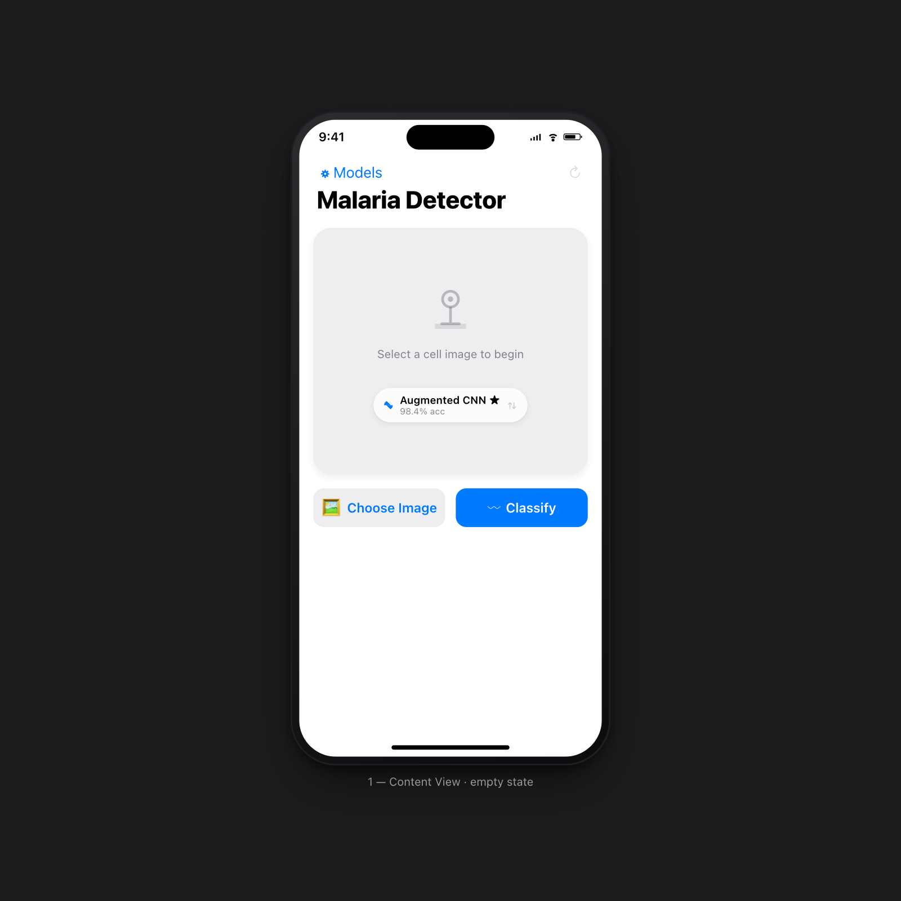 | 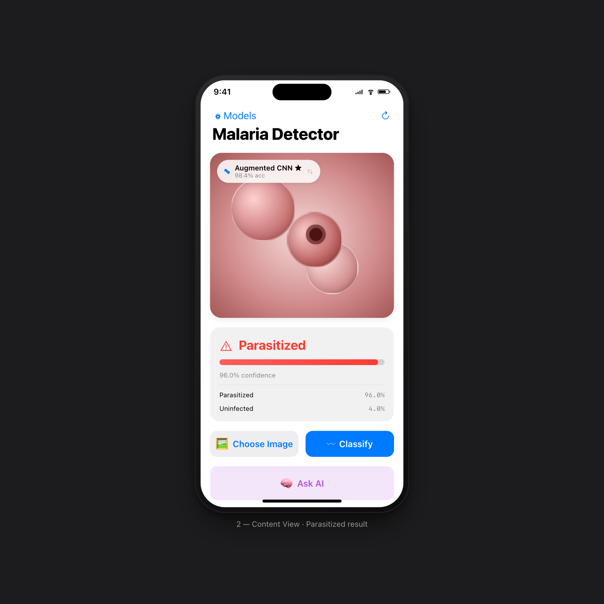 | 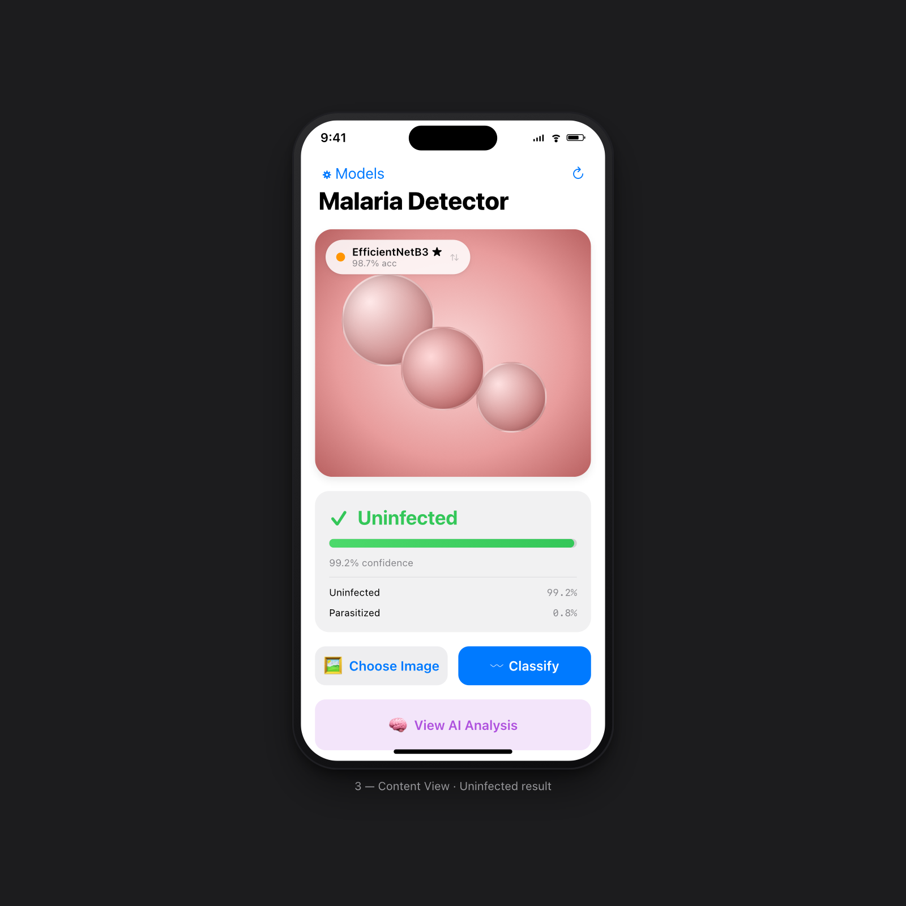 |
| **Content View — empty** <br> Photo tab before any image is selected. The active model badge is tappable and opens the model picker. | **Parasitized result** <br> Risk-banded result card after Core ML inference. Confidence and risk level drive the colour; the *Ask AI* button appears only when LM Studio is reachable. | **Uninfected result** <br> Same card layout in the negative case. The four-level risk band (low/moderate/high/critical) is computed from the parasitized probability, not raw accuracy. |
| 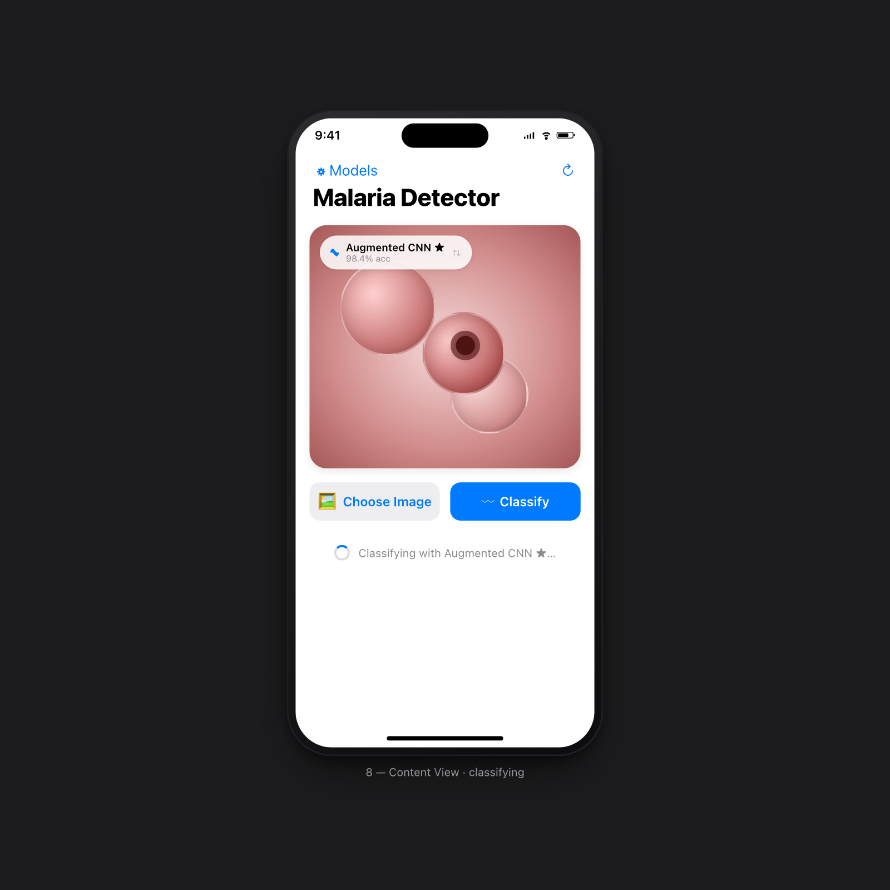 | 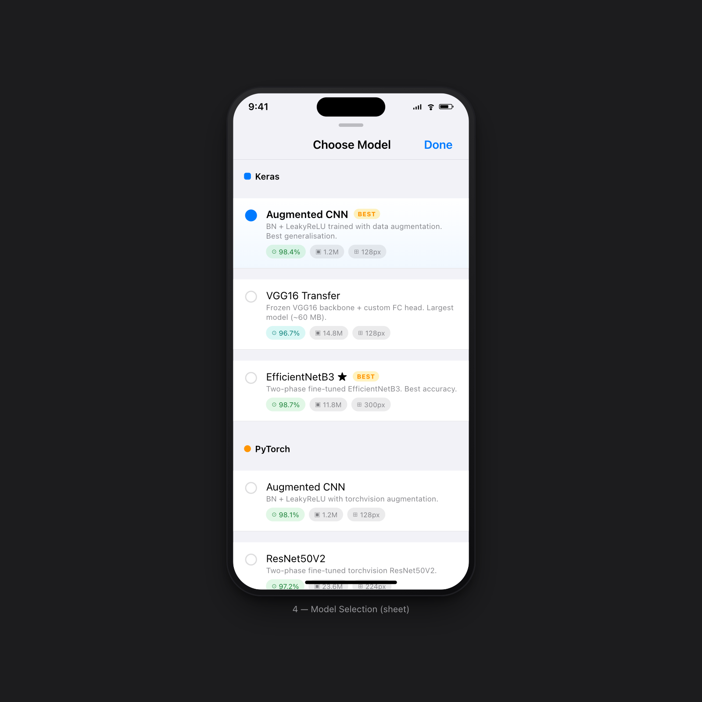 | 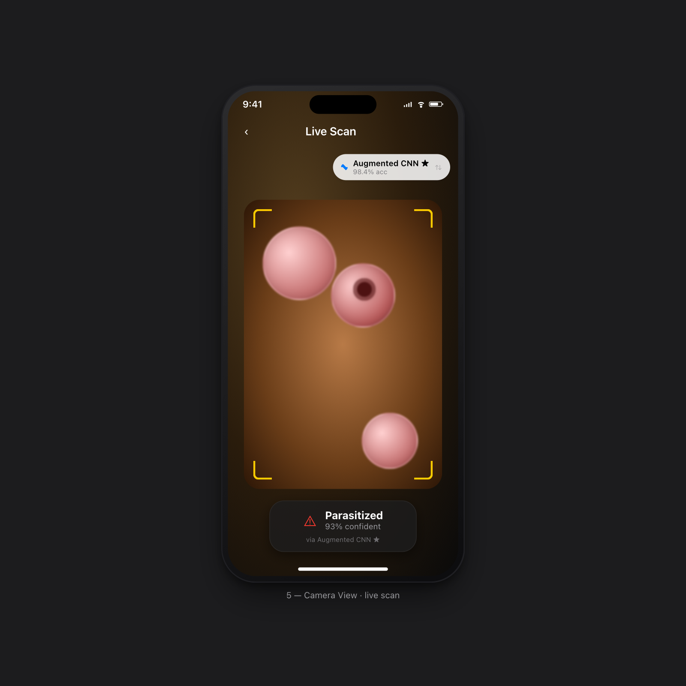 |
| **Classifying** <br> The transient inference state — visible because the `actor`-based classifier runs off the main thread and yields back via `@Observable`. Sub-10 ms on the ANE for most models. | **Model selection sheet** <br> 18 models grouped by framework (Keras / PyTorch) and architecture. Selecting a row eagerly preloads the model into the cache and auto-reclassifies any image already on screen. | **Camera live scan** <br> AVFoundation capture with throttled real-time classification — one `MalariaClassifier` actor reused across frames, an LRU cache of `VNCoreMLModel` keyed by descriptor. |
| 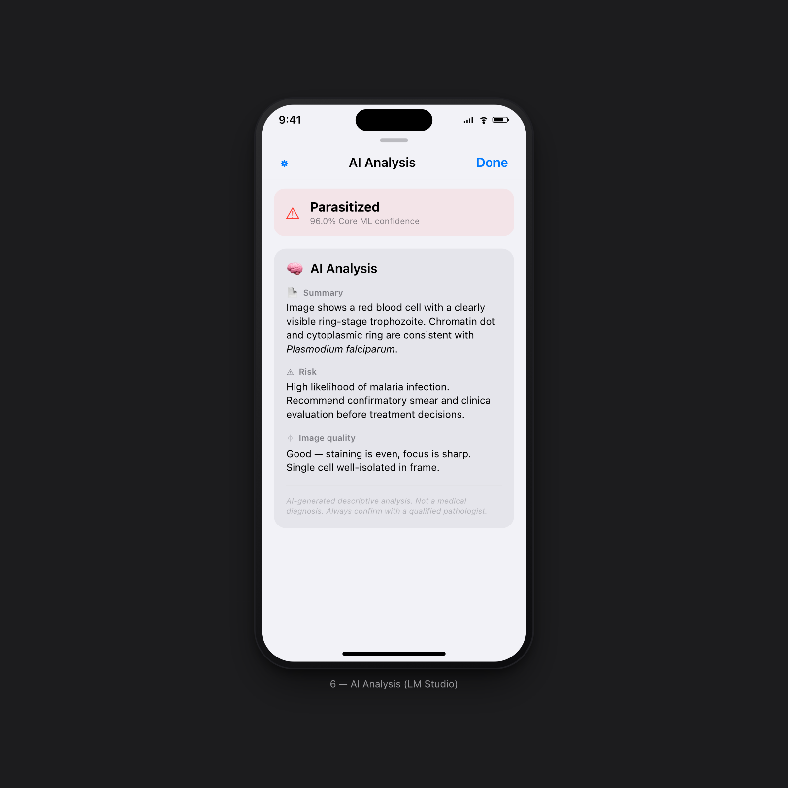 | 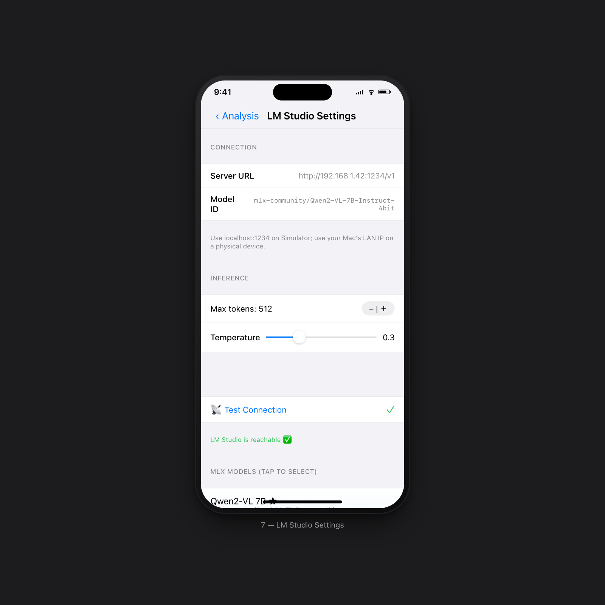 | |
| **AI Analysis sheet** <br> Optional natural-language assessment from a Vision-Language Model running on a Mac on the LAN. Returns a structured *summary / risk / confidence / caveat* block — never a free-form paragraph. | **LM Studio settings** <br> Configure base URL, model name, max tokens, and temperature. MLX quick-fill presets prefill the recommended Qwen2-VL / LLaVA / Phi-3.5-Vision identifiers. | |

### Original tech stack

| Category | Technology | Purpose |
|---|---|---|
| iOS UI | SwiftUI (iOS 17+) | Declarative views, TabView shell, Photos picker |
| App State | `@Observable` + `.environment(_:)` | Single `AppState` shared across all views, no binding chains |
| Concurrency | Swift 6 strict concurrency, `actor`, `async/await` | Thread-safe classifier and LM Studio client |
| On-device ML | Core ML + Vision (`VNCoreMLRequest`) | `.mlpackage` inference on ANE / GPU / CPU |
| Camera | AVFoundation capture session | Live frame acquisition in `CameraViewModel` |
| Photo Library | PhotosPicker + PhotosUI | User-initiated image selection |
| Networking | `URLSession` async APIs | OpenAI-compatible POST to LM Studio |
| Persistence | `UserDefaults` | Remembers selected model and LM Studio configuration |
| Training — framework A | TensorFlow / Keras | Keras models from base CNN through EfficientNetB3 |
| Training — framework B | PyTorch + torchvision | Mirror architectures plus two-phase fine-tuning |
| Augmentation | Keras `ImageDataGenerator`, Albumentations | Rotation, flip, zoom, brightness jitter |
| Preprocessing | OpenCV, NumPy, PIL | Resize, HSV conversion, Gaussian blur, normalisation |
| Export | `coremltools`, ONNX (opset 17) | Keras → Core ML direct; PyTorch → ONNX → Core ML |
| Local VLM | LM Studio + MLX (`mlx-community/Qwen2-VL-7B-Instruct-4bit` recommended) | Natural-language clinical explanation |
| Acceleration | Apple Neural Engine, Metal, MPS, CUDA | Training on Mac / Colab; inference on device |

### Original architecture

The application was organised in two cooperating layers. The **Core ML layer** is always present: an `actor`-based classifier loads the currently selected `.mlpackage` lazily, caches a `VNCoreMLModel` for the session, and returns a `Sendable` `ClassificationResult` to the UI. The **LM Studio layer** is optional: when reachable, it enriches the binary result with a natural-language assessment produced by a Vision-Language Model running on a Mac on the same network.

All shared mutable state lived in a single `@Observable @MainActor AppState` class, injected once at the app root via `.environment(_:)`. Views at any depth read what they need with `@Environment(AppState.self)` — there are no per-view view models and no binding chains. A `ModelRegistry` singleton reads `model_registry.json` from the bundle at launch and exposes sorted, framework-grouped descriptors for the model picker. On-device model files live alongside the registry in the app bundle, with a documented on-demand download path for the heavier architectures (~50 MB EfficientNetB3 / ResNet50V2).

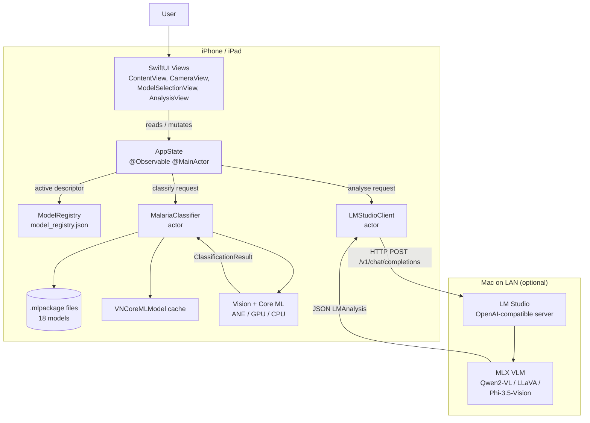
```mermaid
graph TD
    subgraph Device["iPhone / iPad"]
        UI["SwiftUI Views<br/>ContentView, CameraView,<br/>ModelSelectionView, AnalysisView"]
        State["AppState<br/>@Observable @MainActor"]
        Registry["ModelRegistry<br/>model_registry.json"]
        Classifier["MalariaClassifier<br/>actor"]
        LMClient["LMStudioClient<br/>actor"]
        Bundle[(".mlpackage files<br/>18 models")]
        Cache["VNCoreMLModel cache"]
        Vision["Vision + Core ML<br/>ANE / GPU / CPU"]
    end

    subgraph Mac["Mac on LAN (optional)"]
        LMStudio["LM Studio<br/>OpenAI-compatible server"]
        VLM["MLX VLM<br/>Qwen2-VL / LLaVA /<br/>Phi-3.5-Vision"]
    end

    User["User"] --> UI
    UI -->|reads / mutates| State
    State -->|active descriptor| Registry
    State -->|classify request| Classifier
    State -->|analyse request| LMClient
    Classifier --> Cache
    Classifier --> Bundle
    Classifier --> Vision
    Vision -->|ClassificationResult| Classifier
    LMClient -->|HTTP POST /v1/chat/completions| LMStudio
    LMStudio --> VLM
    VLM -->|JSON LMAnalysis| LMClient
```

### Original code structure

#### Planned directory layout

```
MalariaDetector/
├── MalariaDetectorApp.swift
├── Models/
│   ├── DomainTypes.swift           # ModelDescriptor, ClassificationResult, errors
│   ├── ModelRegistry.swift         # Loads model_registry.json, persists selection
│   ├── MalariaClassifier.swift     # actor — Core ML + Vision inference
│   ├── AppState.swift              # @Observable single source of truth
│   ├── LMStudioTypes.swift         # Config, OpenAI-compatible DTOs, LMAnalysis
│   └── LMStudioClient.swift        # actor — HTTP client for LM Studio
├── ViewModels/
│   └── CameraViewModel.swift       # AVFoundation capture + throttled inference
├── Views/
│   ├── ContentView.swift           # Photo tab: picker → result → "Ask AI"
│   ├── CameraView.swift            # Live camera tab
│   ├── ModelSelectionView.swift    # Grouped list across Keras / PyTorch
│   ├── ActiveModelBadge.swift      # Tappable pill showing active model
│   ├── ResultCardView.swift        # Risk-banded classification display
│   ├── AnalysisView.swift          # LM Studio analysis sheet
│   └── LMStudioSettingsView.swift  # URL, model, temperature, MLX presets
└── Resources/
    ├── model_registry.json
    └── malaria_coreml_models/
        ├── Malaria_Base_Keras.mlpackage
        ├── Malaria_Deeper_Keras.mlpackage
        ├── Malaria_BNLeaky_Keras.mlpackage
        ├── Malaria_Augmented_Keras.mlpackage
        ├── Malaria_VGG16_Keras.mlpackage
        ├── Malaria_EfficientNetB0_Keras.mlpackage
        ├── Malaria_EfficientNetB3_Keras.mlpackage
        ├── Malaria_ResNet50V2_Keras.mlpackage
        ├── Malaria_MobileNetV3Large_Keras.mlpackage
        └── …mirrored PyTorch variants…

notebooks/
├── 01_data_and_preprocessing.ipynb
├── 02_tensorflow_64.ipynb
├── 03_pytorch_64.ipynb
├── 04_both_frameworks_128.ipynb
├── 05_advanced_pretrained.ipynb
├── 06_cross_framework_comparison.ipynb
└── 07_coreml_export.ipynb
```

#### Main types

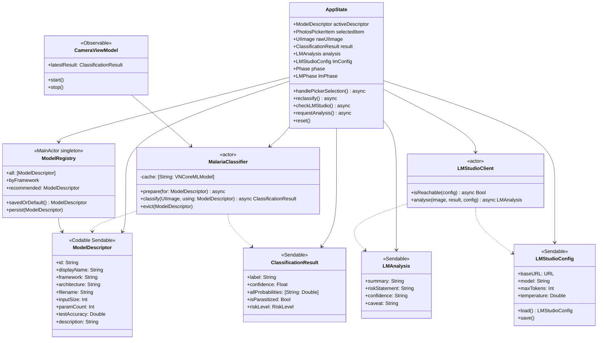
```mermaid
classDiagram
    class AppState {
        +ModelDescriptor activeDescriptor
        +PhotosPickerItem selectedItem
        +UIImage rawUIImage
        +ClassificationResult result
        +LMAnalysis analysis
        +LMStudioConfig lmConfig
        +Phase phase
        +LMPhase lmPhase
        +handlePickerSelection() async
        +reclassify() async
        +checkLMStudio() async
        +requestAnalysis() async
        +reset()
    }

    class MalariaClassifier {
        <<actor>>
        -cache: [String: VNCoreMLModel]
        +prepare(for: ModelDescriptor) async
        +classify(UIImage, using: ModelDescriptor) async ClassificationResult
        +evict(ModelDescriptor)
    }

    class ModelRegistry {
        <<MainActor singleton>>
        +all: [ModelDescriptor]
        +byFramework
        +recommended: ModelDescriptor
        +savedOrDefault() ModelDescriptor
        +persist(ModelDescriptor)
    }

    class ModelDescriptor {
        <<Codable Sendable>>
        +id: String
        +displayName: String
        +framework: String
        +architecture: String
        +filename: String
        +inputSize: Int
        +paramCount: Int
        +testAccuracy: Double
        +description: String
    }

    class ClassificationResult {
        <<Sendable>>
        +label: String
        +confidence: Float
        +allProbabilities: [String: Double]
        +isParasitized: Bool
        +riskLevel: RiskLevel
    }

    class LMStudioClient {
        <<actor>>
        +isReachable(config) async Bool
        +analyse(image, result, config) async LMAnalysis
    }

    class LMStudioConfig {
        <<Sendable>>
        +baseURL: URL
        +model: String
        +maxTokens: Int
        +temperature: Double
        +load() LMStudioConfig
        +save()
    }

    class LMAnalysis {
        <<Sendable>>
        +summary: String
        +riskStatement: String
        +confidence: String
        +caveat: String
    }

    class CameraViewModel {
        <<Observable>>
        +latestResult: ClassificationResult
        +start()
        +stop()
    }

    AppState --> MalariaClassifier
    AppState --> LMStudioClient
    AppState --> ModelRegistry
    AppState --> ModelDescriptor
    AppState --> ClassificationResult
    AppState --> LMAnalysis
    AppState --> LMStudioConfig
    MalariaClassifier ..> ModelDescriptor
    MalariaClassifier ..> ClassificationResult
    ModelRegistry --> ModelDescriptor
    LMStudioClient ..> LMAnalysis
    LMStudioClient ..> LMStudioConfig
    CameraViewModel --> MalariaClassifier
```

### Original sequence diagrams

#### Photo classification plus optional LLM analysis

The primary user flow in the iOS-only design: pick a photo, see a Core ML classification, optionally forward the result to LM Studio for a natural-language explanation.

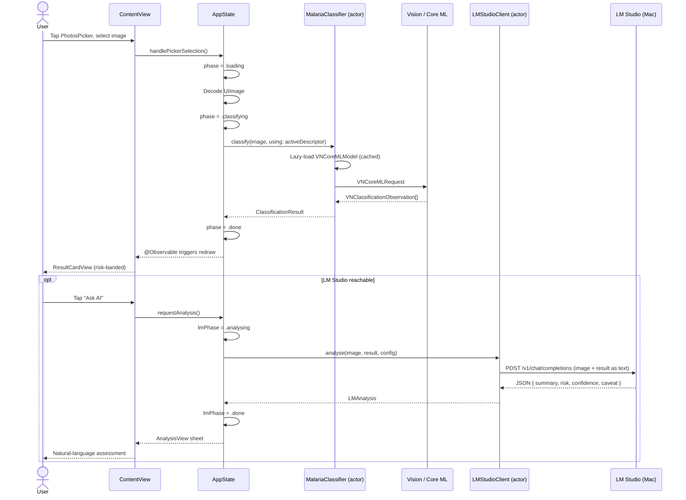
```mermaid
sequenceDiagram
    actor User
    participant View as ContentView
    participant State as AppState
    participant Classifier as MalariaClassifier (actor)
    participant Vision as Vision / Core ML
    participant LMClient as LMStudioClient (actor)
    participant LMStudio as LM Studio (Mac)

    User->>View: Tap PhotosPicker, select image
    View->>State: handlePickerSelection()
    State->>State: phase = .loading
    State->>State: Decode UIImage
    State->>State: phase = .classifying
    State->>Classifier: classify(image, using: activeDescriptor)
    Classifier->>Classifier: Lazy-load VNCoreMLModel (cached)
    Classifier->>Vision: VNCoreMLRequest
    Vision-->>Classifier: VNClassificationObservation[]
    Classifier-->>State: ClassificationResult
    State->>State: phase = .done
    State-->>View: @Observable triggers redraw
    View-->>User: ResultCardView (risk-banded)

    opt LM Studio reachable
        User->>View: Tap "Ask AI"
        View->>State: requestAnalysis()
        State->>State: lmPhase = .analysing
        State->>LMClient: analyse(image, result, config)
        LMClient->>LMStudio: POST /v1/chat/completions (image + result as text)
        LMStudio-->>LMClient: JSON { summary, risk, confidence, caveat }
        LMClient-->>State: LMAnalysis
        State->>State: lmPhase = .done
        State-->>View: AnalysisView sheet
        View-->>User: Natural-language assessment
    end
```

#### Model selection and automatic reclassification

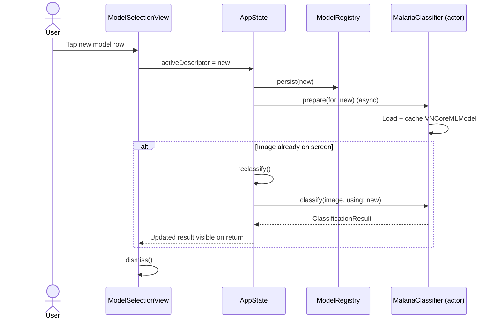
```mermaid
sequenceDiagram
    actor User
    participant Picker as ModelSelectionView
    participant State as AppState
    participant Registry as ModelRegistry
    participant Classifier as MalariaClassifier (actor)

    User->>Picker: Tap new model row
    Picker->>State: activeDescriptor = new
    State->>Registry: persist(new)
    State->>Classifier: prepare(for: new) (async)
    Classifier->>Classifier: Load + cache VNCoreMLModel
    alt Image already on screen
        State->>State: reclassify()
        State->>Classifier: classify(image, using: new)
        Classifier-->>State: ClassificationResult
        State-->>Picker: Updated result visible on return
    end
    Picker->>Picker: dismiss()
```

### Training results

The training notebook trains **nine architectures × two frameworks = 18 model variants** on the NIH cell-image dataset (24,958 train / 2,600 test images, 50/50 class balance) at a dynamically computed `IMG_SIZE = 128`. Each model is exported to a `.mlpackage` and registered for the iOS picker.

> 📓 **[Detailed Analysis](./Malaria_Detection_Detailed_Analysis.ipynb)** — full notebook with every cell output, confusion matrix, ROC curve, and per-model classification report. Also available as a [rendered HTML page](https://htmlpreview.github.io/?https://github.com/arthurkahwa/malaria-detection/blob/main/Malaria_Detection_Detailed_Analysis.html) ([download HTML](./Malaria_Detection_Detailed_Analysis.html)).

#### Architecture staircase — what each technique adds

The first five architectures isolate one technique change per step, so the marginal contribution of each is directly readable from the test-accuracy delta.

| # | Architecture | Added technique | Test accuracy | Params | Notes |
|---|---|---|---|---|---|
| 1 | Base CNN | 2-block Conv + Dense head — minimal baseline | ~94–96% | ~32 K | Establishes the floor |
| 2 | Deeper CNN | Added depth (3 Conv blocks, wider Dense head) | ~95–96% | ~120 K | Depth alone is a small win |
| 3 | BN + LeakyReLU | Batch Normalisation + LeakyReLU | ~97% | ~120 K | **Largest single architectural lift** |
| 4 | Augmented BN+LReLU | Model 3 + on-the-fly augmentation | ~97–98% | ~120 K | Best accuracy-per-kilobyte |
| 5 | VGG16 Transfer | ImageNet-pretrained backbone, frozen | ~96–97% | 14.7 M | Outclassed by modern alternatives |
| 6 | EfficientNetB0 | MBConv + SE blocks, two-phase fine-tune | ~97% | 5.3 M | Strong middleweight |
| 7 | EfficientNetB3 ★ | Same family, scaled compound coefficients | **~97.5–98.5%** | 12 M | **Winner in both frameworks** |
| 8 | ResNet50V2 | Pre-activation residual blocks | ~96–97% | 25 M | Best at ~50 MB; not Pareto-optimal |
| 9 | MobileNetV3Large | h-swish + SE, depth-wise convs | ~95–96% | 4.2 M | <1 ms ANE latency — real-time camera |

#### Final ranked summary

EfficientNetB3 wins on test loss, accuracy, precision, recall, and F1 in **both** TensorFlow/Keras and PyTorch. The two frameworks are within ~0.3% of each other on the same architecture — the choice between them is essentially free. The gap between the top model and the simplest custom CNN is 4–5%, but the parameter cost differs by ~400× (32 K vs 12 M), so for edge deployment the **Augmented BN+LeakyReLU** model remains the best accuracy-per-byte trade-off — which is why it is the model bundled into the KMP app's v0.1.

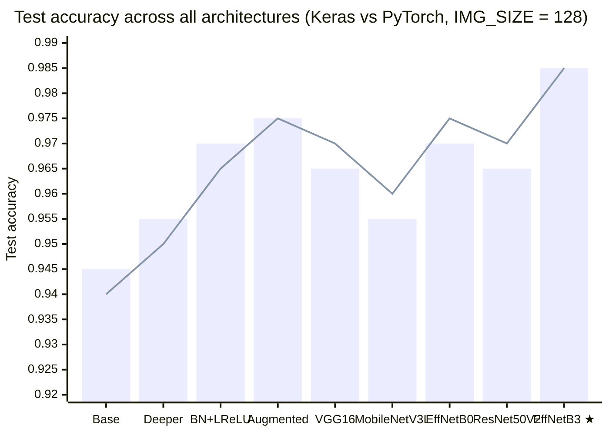
```mermaid
%%{init: {'theme': 'default'}}%%
xychart-beta
    title "Test accuracy across all architectures (Keras vs PyTorch, IMG_SIZE = 128)"
    x-axis ["Base", "Deeper", "BN+LReLU", "Augmented", "VGG16", "MobileNetV3L", "EffNetB0", "ResNet50V2", "EffNetB3 ★"]
    y-axis "Test accuracy" 0.92 --> 0.99
    bar [0.945, 0.955, 0.970, 0.975, 0.965, 0.955, 0.970, 0.965, 0.985]
    line [0.940, 0.950, 0.965, 0.975, 0.970, 0.960, 0.975, 0.970, 0.985]
```

> Bars: Keras / TensorFlow. Line: PyTorch. The 98% threshold is only crossed by EfficientNetB3 in either framework; Augmented Model 3 and EfficientNetB0 sit just below it.

#### Why each technique helped

| Technique | Effect on test accuracy | Effect on overfitting | Trade-off |
|---|---|---|---|
| Normalisation `[0, 255] → [0, 1]` | Non-negotiable — networks plateau on raw pixels | — | Free |
| Added depth | +1–2% | Increases overfitting risk | +4× params |
| BatchNorm + LeakyReLU | +1–2% on top of depth | Reduces overfitting | Negligible |
| Data augmentation | +0.5–1% on top of BN | Lowest overfitting of the custom CNNs | Slower epochs (per-batch transform) |
| ImageNet transfer (VGG16) | Roughly matches Augmented CNN | Very low — frozen backbone | 11× params, 20× slower inference |
| Two-phase fine-tune (EffNetB3) | +1% over Augmented and VGG16 | Very low | 12 M params; ~30 epochs across both phases |

#### Real-time inference profile

The original model picker exposed the full 18-variant matrix so the iOS app could choose between **accuracy** (EfficientNetB3 at 128×128) and **latency** (MobileNetV3Large at 224×224) per use case. The KMP v0.1 bundles only the BNLeaky variant and downloads the rest from Hugging Face on demand.

| Use case | Recommended model | Test accuracy | On-device latency (ANE) | `.mlpackage` size |
|---|---|---|---|---|
| Photo classification (best accuracy) | EfficientNetB3 (Keras) | ~98.5% | ~5–8 ms | ~48 MB |
| Live camera scanning (best latency) | MobileNetV3Large (Keras) | ~95–96% | < 1 ms | ~8 MB |
| Memory-constrained devices | Augmented BN+LeakyReLU (Keras) | ~97% | ~2 ms | < 5 MB |

#### Clinical insight

For malaria screening the *clinically dangerous* error is a **false negative** — a parasitized cell predicted as uninfected. The notebook explicitly demonstrates threshold tuning: rather than leaving the operating point at the default 0.5, plot the Precision-Recall curve and pick the threshold that achieves ≥97% recall on the *Parasitized* class, accepting the lower precision (more false positives → unnecessary follow-up) as the right side of the trade. The KMP app exposes this through the shared `Threshold` module's gray-zone band rather than a hard binary verdict.

> **Note on interpretability.** A productionised version should overlay a Grad-CAM heatmap on the input cell so a clinician can see *why* the model fired. If the heatmap concentrates on the parasite stain region, the model is reasoning correctly; if it concentrates on cell borders or background, retrain.

### Original roadmap

The training and Core ML export work is **complete**; the iOS-only app design has been superseded by the KMP rewrite (see the Phase status table at the top of this README for current status).

| Phase | Scope | Status |
|---|---|---|
| 1 | Dataset preparation, EDA, dynamic `IMG_SIZE` derivation, preprocessing | Complete |
| 2 | TensorFlow / Keras training — Base, Deeper, BN+LeakyReLU, Augmented, VGG16 | Complete |
| 3 | PyTorch training — mirror architectures + VGG16 transfer | Complete |
| 4 | Resolution insights — feature-map dynamics through pooling | Complete |
| 5 | Advanced pre-trained models — EfficientNetB0/B3, ResNet50V2, MobileNetV3Large | Complete |
| 6 | Cross-framework and cross-architecture ranked comparison | Complete |
| 7 | Core ML export (Keras direct, PyTorch via ONNX opset 17) — 18 `.mlpackage` files | Complete |
| 8 | iOS 17 SwiftUI app — Photo tab, classifier actor, model picker | Superseded by KMP rewrite |
| 9 | Live camera tab with throttled real-time classification | Superseded by KMP rewrite |
| 10 | LM Studio integration — client actor, settings, analysis sheet | Dropped in KMP rewrite |
| 11 | On-demand download path for heavyweight models + memory-pressure eviction | Folded into KMP Phase 11 |
| 12 | App Store review pass — accessibility, localisation, privacy manifest | Folded into KMP Phases 12 + 17 |

### Headline metrics (ML training)

| Metric | Achieved |
|---|---|
| Best test accuracy (EfficientNetB3, 128×128) | **~97.5 – 98.5%** in both Keras and PyTorch |
| Best real-time model (MobileNetV3Large) latency on ANE | **< 1 ms** |
| Smallest deployed model size | **< 5 MB** (Augmented BN+LeakyReLU) |
| Architectures × frameworks shipped to Core ML | **9 × 2 = 18 `.mlpackage` files** |
| Test set size | 2,600 images (50/50 class balance) |
| Cross-framework agreement on top model | within ~0.3% accuracy |
