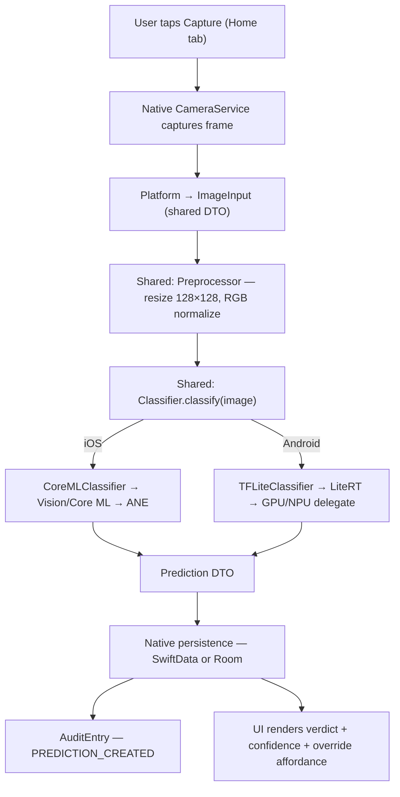

# ARCHITECTURE

> **Status: scaffold**

Source: `KMP_App_Specification.md` §4–6.

## Layered architecture (shared Kotlin / native persistence / native UI)

Three layers, applied identically across iOS and Android:

1. **Shared Kotlin (KMP module).** Business logic, domain DTOs, ML inference
   interface (`expect class Classifier`), image preprocessing, session
   grouping, threshold logic, role-based permissions, retention policy, and
   model registry parsing. The shared module produces an XCFramework consumed
   via SPM on iOS and an AAR consumed via `implementation(project(":shared"))`
   on Android. Spec §5 enumerates exactly what is in `commonMain` and what is
   intentionally not.
2. **Native persistence.** SwiftData `@Model` on iOS, Room `@Entity` on
   Android. The canonical schema is in `docs/SCHEMA.md`; the two
   implementations are kept aligned by CI snapshot tests. The shared
   `Prediction` DTO is mapped at the platform boundary into the native
   entity.
3. **Native UI.** SwiftUI with Liquid Glass on iOS, Compose with Material 3
   Expressive on Android. UI is **not** shared. The choice was reaffirmed
   against Compose Multiplatform in v1 (spec §24): native per-platform UI
   stays, with the v2-conditional question being whether *specific* screens
   migrate, never whether the whole UI layer changes paradigm.

## No ViewModels — environment-injected services

There are no ViewModel classes on either platform. Composition roots
(`MalariaDetectorApp.swift` on iOS, `MalariaApplication.kt` on Android) build
a fully-wired environment of `@Observable` services on iOS / `CompositionLocal`
providers on Android, and views read what they need directly:

- **iOS:** `@Environment(AppState.self)` and `@Environment(\.classifier)`.
  Tests construct environments with test doubles
  (`.environment(\.classifier, MockClassifier())`), no ViewModel mocking
  required.
- **Android:** `CompositionLocalProvider(LocalClassifier provides ...)`. UI
  tests provide test-double services via the same composition pattern.

This matches the spec's testing strategy (§20): no extra abstraction layer to
mock; tests build the same shape of environment that production does, with
fakes.

## Concurrency model (iOS Swift 6 / Android Kotlin coroutines)

- **iOS:** Swift 6 with `-strict-concurrency=complete`. Services that own
  mutable state are `@Observable @MainActor`. CPU-bound or long-lived work
  goes through `actor`-isolated services
  (`MalariaClassifier`, `LMStudioClient`). Scene-phase observers and Combine
  timers drive the session-timer `touch()` / `checkTimeout()` from spec §9.
- **Android:** Kotlin coroutines with `Dispatchers.Main.immediate` for UI
  state, `Dispatchers.Default` or `Dispatchers.IO` for inference and I/O. The
  shared `SessionTimer` is consumed by an Android `LifecycleObserver` plus a
  coroutine-based periodic check. `StateFlow` collectors back the UI; the
  test strategy uses `turbine` (or hand-rolled `Flow` assertions) for state
  transitions.

The shared `SessionTimer`, `Threshold`, `SessionGrouping`, `Permissions`,
and `RetentionPolicy` modules are pure Kotlin and reused verbatim across
platforms.

## Data flow: one screening end to end

The shape is identical on both platforms. The only divergence is the
inference backend and the native persistence target. See spec §6 for the
full step-by-step expansion.

## Shared module: what's in it, what's not

**In commonMain** (spec §5):

- Domain DTOs (`Prediction`, `ImageInput`)
- Enums (`ClinicianRole`, `OverrideContext`, `OverrideReason`,
  `Jurisdiction`, `LawfulBasis`)
- `Threshold` (default threshold, gray-zone band, `label()`,
  `shouldFlagForReview()`)
- `SessionGrouping` (30-minute implicit gap rule)
- `Permissions` (role × action matrix)
- `Classifier` `expect` class
- Image preprocessing
- `RetentionPolicy` (advisory only — never auto-deletes)
- `ModelRegistry` (parses `model_registry.json`)

**Not in commonMain** (native code only):

- Persistence entities and databases (`@Model` / `@Entity`)
- Keychain / Keystore integration
- Biometric prompts
- Camera capture
- UI of any kind
- Crash log writing
- Hugging Face downloader (uses platform HTTP clients)
- Audit log writing

The audit log *schema* lives in shared docs (`SCHEMA.md`); the writer is
platform-native because audit entries are persisted entities.
